# GRAPHS.md

This document explains the architecture of Zork I's game engine with visual diagrams showing how objects are classified, stored, parsed, and executed.

## 1. World Object Classification

Zork I uses a hierarchical object system where everything in the game world is an OBJECT with various properties and flags.

### Object Types and Properties

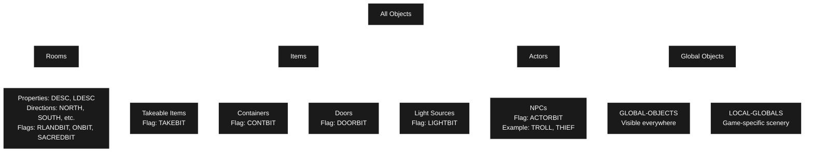

### Object Storage Example

Objects are stored with these key properties:

```python
class SKULL(Object):
    location =      LAND_OF_LIVING_DEAD             # Parent container
    synonyms =      ["SKULL", "HEAD", "TREASURE"]   # Words player can use
    adjectives =    ["CRYSTAL"]                     # Descriptive words
    description =   "crystal skull"                 # Short description
    first_desc =    "Lying in one corner..."        # First-time description
    flags =         [TAKEBIT]                       # Behavior flags
    value =         10                              # Point value
    treasure_value= 10                              # Treasure value
```

### Built-in Object Hierarchy (structural)

Objects can contain other objects, creating a location tree.

- **Purpose**: World organization and code structure
- **Examples**:
    - ROOMS contains all room objects
    - GLOBAL-OBJECTS contains objects available everywhere
    - A room contains objects currently in that location
- **Always active**: Every object has a location (parent)

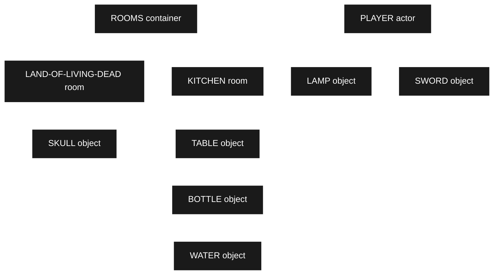

### Common Object Flags

| Flag | Purpose | Example Objects |
|------|---------|----------------|
| `TAKEBIT` | Object can be picked up | SKULL, LAMP, SWORD |
| `ACTORBIT` | Object is an NPC/actor | TROLL, THIEF, PLAYER |
| `DOORBIT` | Object can be opened/closed | GRATE, TRAP-DOOR |
| `LIGHTBIT` | Object provides light | LAMP, CANDLES |
| `WEAPONBIT` | Object is a weapon | SWORD, AXE, STILETTO |
| `TOOLBIT` | Object is a tool | SCREWDRIVER, SHOVEL |
| `CONTBIT` | Object is a container: you can put and take objects | BASKET, BAG, COFFIN |
| `NDESCBIT` | Don't auto-describe object | WALLS, GROUND |
| `OPENBIT` | Object is currently open | (dynamic state) |
| `ONBIT` | Object is currently on/lit | (dynamic state) |
| `SURFACEBIT` | Object is a container of type surface: you can put and take objects but not open or close it| TABLE, PEDESTAL |
| `TAKEBIT ` | Object is takeable | LAMP, SHOVEL |
| `TRYTAKEBIT` | Object althoug appears takeable its not. For avoid excess output in TAKE ALL orders | PEDESTAL, TRAP-DOOR |

---

### CONTBIT Container System (gameplay mechanic)
The container system in Zork uses three main flags plus a capacity property to create a flexible object containment system enabling gameplay-specific behaviors that don't apply to the structural hierarchy

- **Purpose**: Player-interactive containers with game rules
    - the open/close mechanics
    - the PUT/TAKE mechanics
    - the LOOK IN behavior
    - capacity limits 
- **Example**: the bottle
From 1dungeon.zil:445-448:
```python
class BOTTLE(Object):
    synonyms = ["BOTTLE", "CONTAINER"]
    description = "glass bottle"
    flags = [TAKEBIT, TRANSBIT, CONTBIT]
```
- Structural parent: Changes based on location (kitchen, player inventory, etc.)
- behavior flags:
    - CONTBIT: Makes it work with PUT/TAKE/OPEN/CLOSE/LOOK-IN commands (container mechanics)
    - TRANSBIT + CONTBIT: You can see water inside without opening it

#### Container Flags:

1. CONTBIT - "This is a container"
>Marks an object as capable of holding other objects inside it.

2. OPENBIT - "Container is currently open"
>Tracks whether the container is in an open state. Only open containers allow access to their contents.

3. TRANSBIT - "Container is transparent"
>Allows you to see contents even when the container is closed (like a glass bottle).

4. CAPACITY (via P?CAPACITY)
>A numeric value determining how much the container can hold. The capacity is checked against the combined weight/size of objects being inserted.

5. SURFACEBIT (dumb container)
>Objects with the SURFACEBIT flag cannot be opened and closed, you can only put or take objects from it.

#### Examples

  Example 1: see through basket (TRANSBIT + CONTBIT + OPENBIT)

  BASKET (1dungeon.zil:142)
  >TRANSBIT TRYTAKEBIT CONTBIT OPENBIT
  >CAPACITY 50
  - Can hold objects (CONTBIT)
  - Currently open (OPENBIT)
  - Can see inside even if closed (TRANSBIT)
  - Holds up to 50 units

  Example 2: Trophy Case (TRANSBIT + CONTBIT)

  TROPHY-CASE (1dungeon.zil:343)
  >TRANSBIT CONTBIT NDESCBIT TRYTAKEBIT SEARCHBIT
  >CAPACITY 10000
  - Can hold objects (CONTBIT)
  - No OPENBIT initially - it's glass, always visible (TRANSBIT)
  - Large capacity for storing treasures

  Example 3: Regular Chalice (CONTBIT only)

  CHALICE (1dungeon.zil:360)
  (FLAGS TAKEBIT TRYTAKEBIT CONTBIT)
  - Can hold objects (CONTBIT)
  - NOT transparent - can't see inside
  - No explicit CAPACITY listed (uses default)

  Example 4: Pedestal (CONTBIT, SURFACEBIT)

  PEDESTAL (1dungeon.zil:980)
  (FLAGS NDESCBIT CONTBIT OPENBIT SURFACEBIT)
  - Can hold objects (CONTBIT)
  - Can take and put objects on it (OPENBIT by default)
  - Can be LOOK ON (SURFACEBIT)
  - No explicit CAPACITY listed (uses default)


  ---
  Visibility Logic (gverbs.zil:1837-1839)

```python
def can_see_inside(obj):
    """Check if you can see inside a container"""
    return (not obj.has_flag(INVISIBLE) and
            (obj.has_flag(TRANSBIT) or obj.has_flag(OPENBIT)))
```

  You can see inside a container if:
  - It's not invisible, AND
  - It's either transparent (TRANSBIT) OR open (OPENBIT)

  ---
  Interaction Checks:

  Opening/Closing (gverbs.zil:967-968)

```python
def can_open_close(obj):
    """Check if object can be opened/closed"""
    return obj.has_flag(CONTBIT) and obj.capacity > 0
```
  Only objects with CONTBIT and non-zero capacity can be opened.

  Putting Items In (gverbs.zil:1092-1102)

```python
def can_put_item_in_container(item, container):
    """Check if item can be put in container"""
    if not container.has_flag(OPENBIT):
        print(f"The {container.desc} isn't open.")
        return False

    total_weight = container.weight + item.weight
    if total_weight > container.capacity:
        print("There's no room.")
        return False

    return True
```
  - Container must be open (OPENBIT)
  - Total weight must not exceed CAPACITY

  Drinking/Pouring (gverbs.zil:509)

```python
def can_access_liquid(container):
    """Check if liquid inside container is accessible"""
    if not container.has_flag(OPENBIT):
        print(f"You'll have to open the {container.desc} first.")
        return False
    return True
```
  Must open container before accessing liquids inside.

  ---
  Summary

  The container system combines:
  - CONTBIT: "I can hold things"
  - OPENBIT: "I'm currently open for access"
  - TRANSBIT: "You can see my contents even when closed"
  - CAPACITY: "This is my maximum holding size"

  This creates different container types: opaque boxes that must be opened, transparent bottles you can see through, open baskets, tables with items on top, and large trophy cases - all using the same flexible flag system.

--- 

### Lock System

Zork I implements a **minimal lock system** without dedicated lock flags. Instead, it uses **custom object action routines** and **global variables** to handle locking/unlocking behavior.

#### Key Components:

**1. The Skeleton Key Object** (1dungeon.zil:841-847)
```python
class KEYS(Object):
    location = MAZE_5
    synonyms = ["KEY"]
    adjectives = ["SKELETON"]
    description = "skeleton key"
    flags = [TAKEBIT, TOOLBIT]
```
- Found in MAZE-5
- Has TOOLBIT flag (required for LOCK/UNLOCK syntax)
- Used to unlock the grate

**2. Lock/Unlock Verbs** (gverbs.zil:855-856, 1508-1509)
```python
def v_lock():
    """Default lock verb handler"""
    print("It doesn't seem to work.")
    return

def v_unlock():
    """Default unlock verb handler"""
    return v_lock()  # Calls lock handler
```
- Default handlers simply print "It doesn't seem to work"
- Objects override this with custom ACTION routines

**3. Syntax Definitions** (gsyntax.zil:294-295, 516-517)
```python
# LOCK <object> WITH <tool>
syntax_lock = SyntaxRule(
    verb="LOCK",
    direct_object=ObjectSpec(location=["ON_GROUND", "IN_ROOM"]),
    indirect_object=ObjectSpec(flags=[TOOLBIT], location=["HELD", "CARRIED", "ON_GROUND", "IN_ROOM", "TAKE"]),
    action=v_lock
)

# UNLOCK <object> WITH <tool>
syntax_unlock = SyntaxRule(
    verb="UNLOCK",
    direct_object=ObjectSpec(location=["ON_GROUND", "IN_ROOM"]),
    indirect_object=ObjectSpec(flags=[TOOLBIT], location=["HELD", "CARRIED", "ON_GROUND", "IN_ROOM", "TAKE"]),
    action=v_unlock
)
```
- Both require a TOOLBIT object (like KEYS or SCREWDRIVER)
- Player can type "LOCK GRATE WITH KEY" or "UNLOCK DOOR WITH KEY"

---

#### Example: The Grate Lock System

The grate demonstrates the custom lock implementation pattern:

**Global State Variable** (1actions.zil:772)
```python
GRUNLOCK = False  # False = locked, True = unlocked
```

**Grate Action Handler** (1actions.zil:850-889)

**Locking the Grate:**
```python
def grate_lock_action():
    """Handle locking the grate"""
    global GRUNLOCK

    if current_verb == "LOCK":
        if HERE == GRATING_ROOM:
            GRUNLOCK = False  # Set to locked
            print("The grate is locked.")
        elif HERE == GRATING_CLEARING:
            print("You can't lock it from this side.")
```
- Can only lock from inside (GRATING-ROOM)
- Cannot lock from outside (GRATING-CLEARING)

**Unlocking the Grate:**
```python
def grate_unlock_action():
    """Handle unlocking the grate"""
    global GRUNLOCK

    if current_verb == "UNLOCK" and PRSO == GRATE:
        if HERE == GRATING_ROOM and PRSI == KEYS:
            GRUNLOCK = True  # Set to unlocked
            print("The grate is unlocked.")
        elif HERE == GRATING_CLEARING and PRSI == KEYS:
            print("You can't reach the lock from here.")
        else:
            print(f"Can you unlock a grating with a {PRSI.desc}?")
```
- Requires KEYS object as indirect object
- Must be in GRATING-ROOM (can't reach from GRATING-CLEARING)
- Rejects wrong tools

**Opening/Closing Gated by Lock State:**
```python
def grate_open_close():
    """Handle opening/closing the grate"""
    if current_verb in ["OPEN", "CLOSE"]:
        if GRUNLOCK:  # Only if unlocked
            open_close(GRATE,
                      "The grating opens.",
                      "The grating is closed.")
        else:
            print("The grating is locked.")
```
- OPEN/CLOSE only work if GRUNLOCK is true
- Otherwise prints "The grating is locked"

**Lock Picking Prevention:**
```python
def grate_pick():
    """Prevent lock picking"""
    if current_verb == "PICK":
        print("You can't pick the lock.")
```

---

#### Example: The Trap Door

The trap door has a different lock behavior - it's **one-way only**:

**Trap Door Handler** (1actions.zil:504-530)
```python
def trap_door_action():
    """Handle trap door interactions"""

    # From above (Living Room) - can open/close normally
    if current_verb in ["OPEN", "CLOSE"] and HERE == LIVING_ROOM:
        open_close(PRSO,
                  "The door reluctantly opens to reveal a rickety staircase...",
                  "The door swings shut and closes.")

    # From below (Cellar) - locked from above!
    elif HERE == CELLAR:
        if current_verb in ["OPEN", "UNLOCK"] and not TRAP_DOOR.has_flag(OPENBIT):
            print("The trap door is locked from above.")
```
- Opens normally from LIVING-ROOM (above)
- **Cannot be opened from CELLAR (below)** - always locked from that side
- No key needed - mechanical one-way lock

---

#### Design Pattern: No LOCKBIT Flag

**Why no LOCKBIT flag?**

Unlike OPENBIT (which tracks open/closed state), Zork I has **no generic LOCKBIT flag**. Instead:

1. **Each lockable object uses a custom global variable**
   - `GRUNLOCK` for the grate
   - Could have `DOORLOCK` for doors, etc.

2. **Lock state is checked in the object's ACTION routine**
   - More flexible than a flag
   - Allows location-specific behavior
   - Can require specific keys
   - Can prevent lock picking

3. **Advantages of this approach:**
   - Each lock can have unique behavior
   - Can check for specific keys (not just any TOOLBIT)
   - Can have one-way locks (trap door)
   - Can have location restrictions (can't lock grate from outside)

4. **Disadvantages:**
   - More verbose code
   - No generic lock/unlock system
   - Each lockable object needs custom handling

---

#### Summary

The lock system in Zork I:
- **No LOCKBIT flag** - uses custom global variables per object
- **LOCK/UNLOCK verbs** accept TOOLBIT objects (keys, screwdrivers)
- **Custom ACTION routines** handle lock logic for each object
- **Examples:**
  - **Grate**: Requires skeleton key, only unlockable from inside
  - **Trap Door**: One-way mechanical lock, no key needed
- **Pattern**: Each lockable object gets a global variable and custom verb handlers

This gives maximum flexibility but requires more code per lockable object.


## 2. Parser Architecture

The parser converts player text input into executable actions. It uses a multi-stage pipeline.

### Parser Pipeline

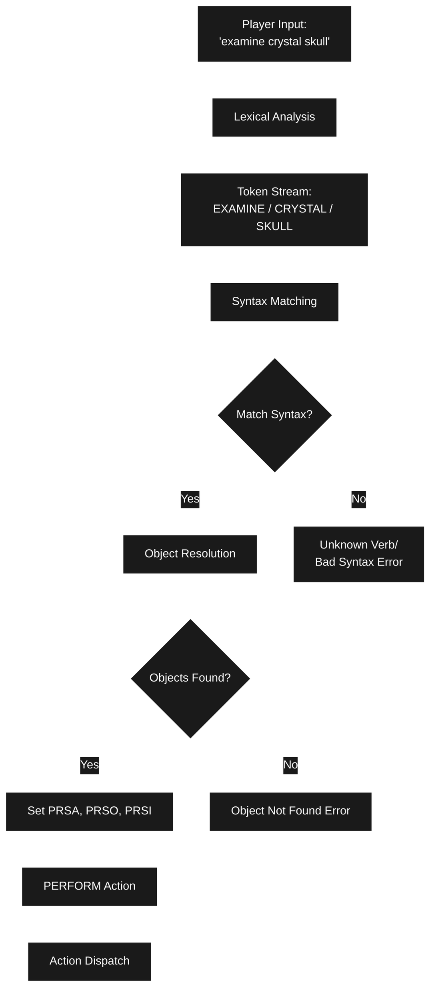

### Lexical Analysis Details

The parser uses lexical tables to recognize words:

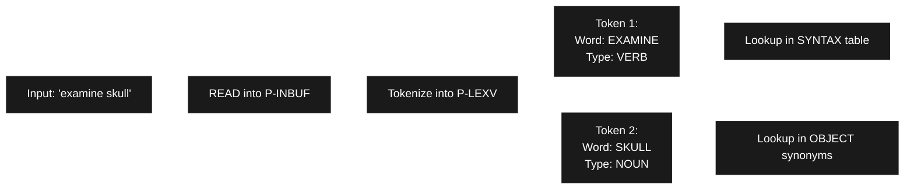

### Key Parser Data Structures

```
P-LEXV      - Lexical vector (tokenized input)
P-ITBL      - Input table (parsed command structure)
  P-VERB    - Verb index
  P-VERBN   - Verb number
  P-PREP1   - First preposition
  P-NC1     - First noun clause
  P-NC2     - Second noun clause

Global Variables After Parsing:
  PRSA      - Action (verb number, e.g., V?EXAMINE)
  PRSO      - Direct object (primary object)
  PRSI      - Indirect object (secondary object)
```

---

## 3. Syntax Definition System

Verbs are defined with SYNTAX declarations that specify:
- The verb and its synonyms
- Required/optional objects
- Object requirements (flags, location)
- Which action routine to call

### Example Syntax Declarations

```python
# EXAMINE command - can examine multiple objects
syntax_examine = SyntaxRule(
    verb="EXAMINE",
    synonyms=["DESCRIBE", "WHAT", "WHATS"],
    direct_object=ObjectSpec(many=True),
    action=v_examine
)

# TAKE command - object must have TAKEBIT flag
syntax_take = SyntaxRule(
    verb="TAKE",
    synonyms=["GET", "HOLD", "CARRY", "REMOVE", "GRAB", "CATCH"],
    direct_object=ObjectSpec(
        flags=[TAKEBIT],
        location=["ON_GROUND", "IN_ROOM"],
        many=True
    ),
    action=v_take,
    pre_action=pre_take
)

# ATTACK command - attack ACTOR with WEAPON
syntax_attack = SyntaxRule(
    verb="ATTACK",
    synonyms=["FIGHT", "HURT", "INJURE", "HIT"],
    direct_object=ObjectSpec(
        flags=[ACTORBIT],
        location=["ON_GROUND", "IN_ROOM"]
    ),
    indirect_object=ObjectSpec(
        flags=[WEAPONBIT],
        location=["HELD", "CARRIED", "HAVE"]
    ),
    action=v_attack
)

# OPEN command - object must have DOORBIT flag
syntax_open = SyntaxRule(
    verb="OPEN",
    direct_object=ObjectSpec(
        flags=[DOORBIT],
        location=["HELD", "CARRIED", "ON_GROUND", "IN_ROOM"]
    ),
    action=v_open
)
```

**Object Search Constraints:**
- `FIND TAKEBIT` - Must have TAKEBIT flag
- `ON-GROUND` - Must be on ground in current room
- `IN-ROOM` - Must be visible in current room
- `HELD` - Must be held by player
- `CARRIED` - Must be carried by player
- `HAVE` - Must be held or carried
- `MANY` - Can specify multiple objects

---

## 4. Action Dispatch System (PERFORM)

Once the parser sets PRSA (action), PRSO (direct object), and PRSI (indirect object), the PERFORM routine dispatches the action through a priority chain.

### PERFORM Dispatch Chain

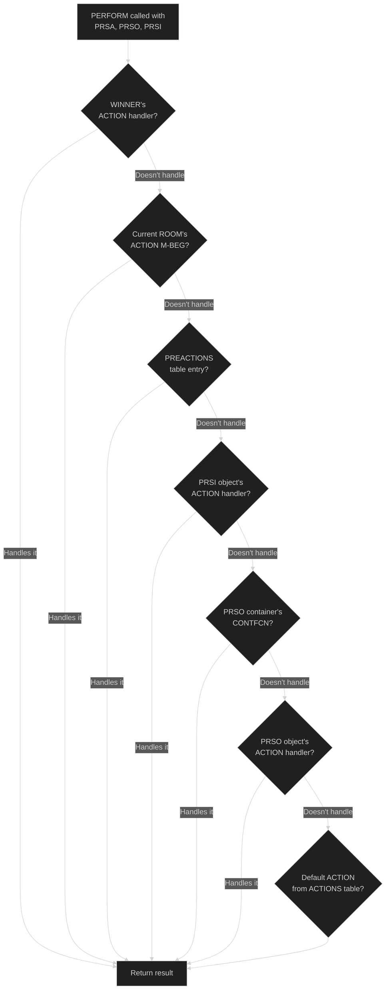

### Action Handler Return Values

Action handlers must return:
- `M-HANDLED` (1) - Action successfully handled, stop dispatch chain
- `M-NOT-HANDLED` (<>) - Action not handled, continue to next handler
- `M-FATAL` (2) - Fatal error, stop entire turn processing

---

## 5. Complete Command Flow Examples

### Example 1: "EXAMINE SKULL"

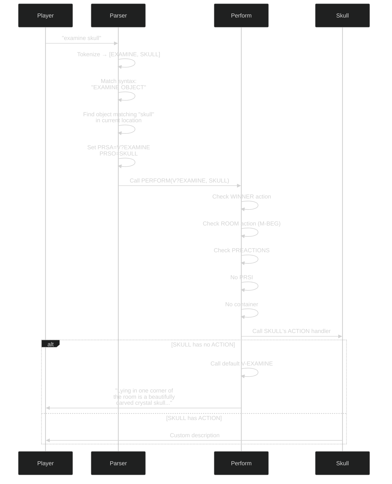

### Example 2: "GO DOWN"

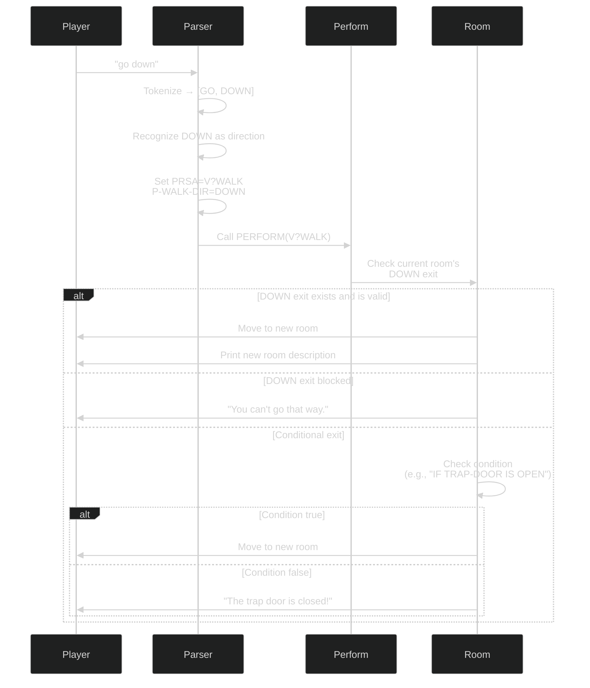

### Example 3: "ATTACK TROLL WITH SWORD"

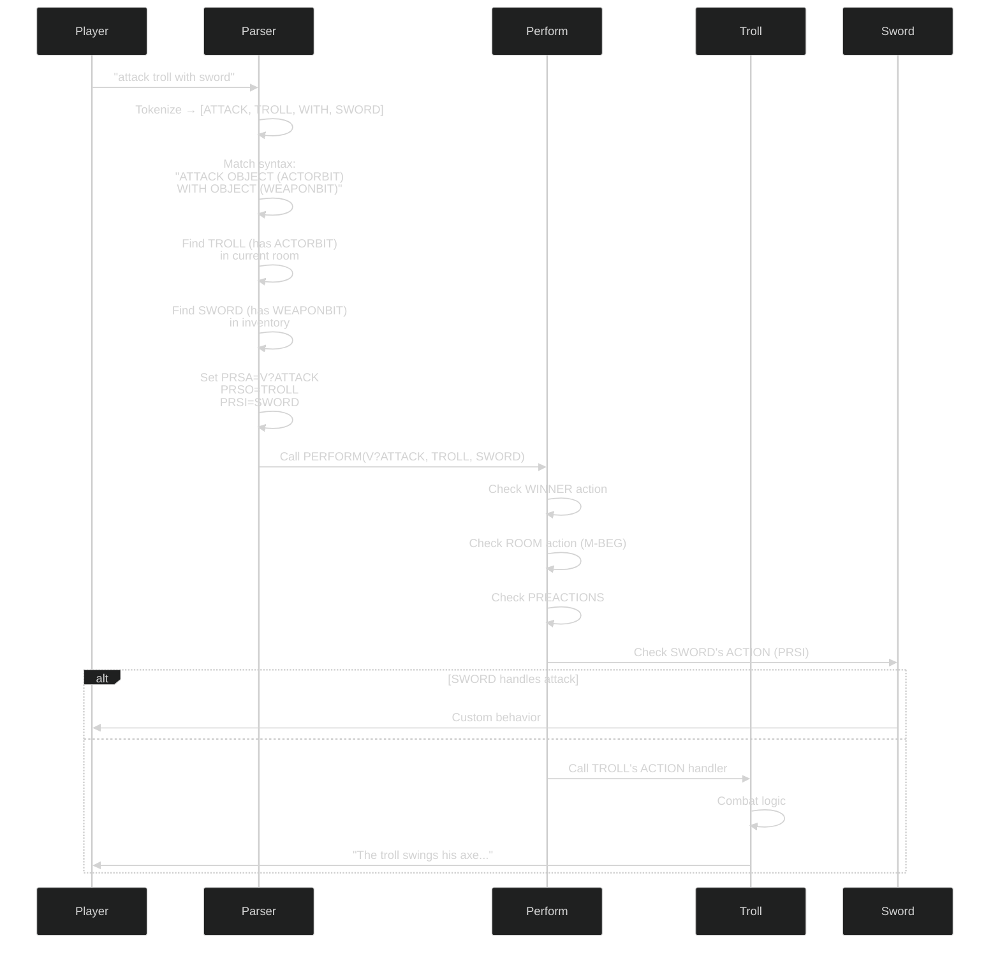

### Example 4: "EXITS" (Meta Command)

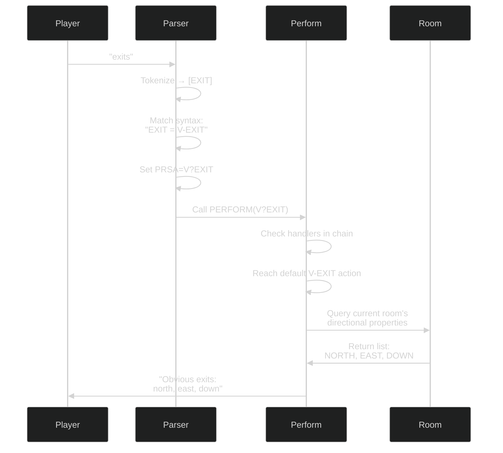

---

## 6. Object Location and Visibility

Objects are only visible/accessible based on their location in the object tree.

### Accessibility Rules

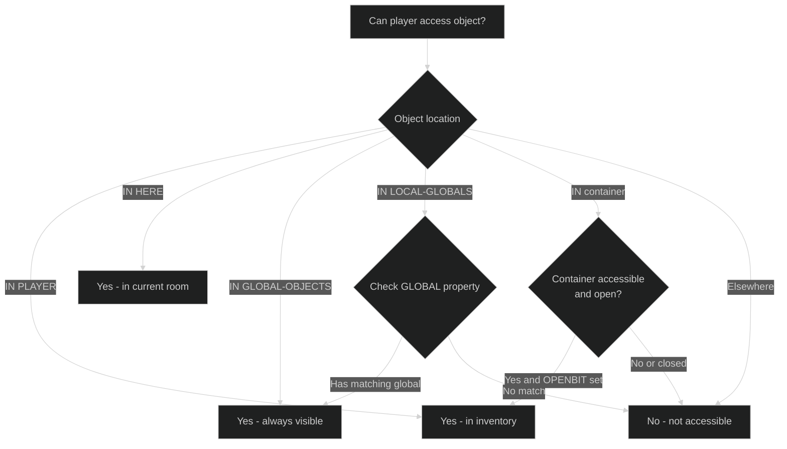

### Example Object Tree at Runtime

```
ROOMS
  ├─ KITCHEN (current location)
  │   └─ TABLE (CONTBIT, SURFACEBIT)
  │       └─ BOTTLE (CONTBIT, OPENBIT)
  │           └─ WATER
  │
  └─ LAND-OF-LIVING-DEAD
      └─ SKULL (not accessible from KITCHEN)

PLAYER (WINNER)
  ├─ LAMP (accessible - in inventory)
  └─ SWORD (accessible - in inventory)

GLOBAL-OBJECTS (always accessible)
  ├─ GROUND
  ├─ WALLS
  └─ GRUE

LOCAL-GLOBALS
  └─ KITCHEN-WINDOW (accessible when in KITCHEN)
```

**Parser Resolution:**
- `"take skull"` → Not found (SKULL is in different room)
- `"examine lamp"` → Found (LAMP in inventory)
- `"examine ground"` → Found (GROUND is global)
- `"examine window"` → Found (KITCHEN-WINDOW has KITCHEN in GLOBAL)
- `"take water"` → Found (WATER in BOTTLE, BOTTLE is open and in room)

---

## 7. Main Game Loop

The game runs in a continuous loop processing commands.

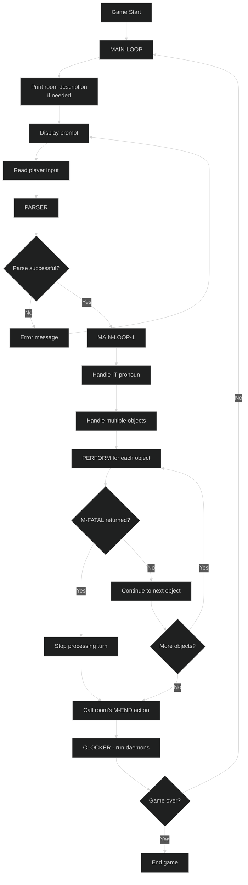

### Turn Processing Example

```
Player input: "take all"

1. Parser expands "all" → [LAMP, SWORD, BOTTLE, TABLE]
2. For each object:
   - "lamp: "
   - PERFORM(V?TAKE, LAMP)
   - "Taken."

   - "sword: "
   - PERFORM(V?TAKE, SWORD)
   - "Taken."

   - "bottle: "
   - PERFORM(V?TAKE, BOTTLE)
   - "Taken."

   - "table: "
   - PERFORM(V?TAKE, TABLE)
   - "The table is too heavy to carry."

3. Room M-END action
4. CLOCKER updates (daemons, timers)
5. Return to main loop
```

---

## 8. Special Object Categories

### Pseudo-Objects

Rooms can define pseudo-objects that don't exist as real objects but respond to commands:

```zil
<ROOM LIVING-ROOM
    ...
    (PSEUDO "NAILS" NAILS-PSEUDO "NAIL" NAILS-PSEUDO)>
```

When player types "examine nails", the NAILS-PSEUDO routine is called instead of looking for a real object.

### Special Global Objects

```python
# Special pronoun object - refers to last mentioned object
IT = None  # Updated after each command

# Placeholder for objects not found during parsing
NOT_HERE_OBJECT = Object()  # Generates "You can't see any X here!"

# Template for player actor
ADVENTURER = Object()  # Used for initialization
```

**How IT works:**
```python
# Player: "examine skull"
PRSO = SKULL
IT = SKULL  # IT now refers to skull

# Player: "take it"
PRSO = IT  # Resolves to SKULL
# Executes: TAKE SKULL
```

---

## Summary

The Zork I engine architecture:

1. **Objects** are stored in a hierarchical tree with properties (DESC, SYNONYM, etc.) and flags (TAKEBIT, ACTORBIT, etc.)

2. **Parser** tokenizes input, matches against SYNTAX definitions, resolves objects by location and flags, sets PRSA/PRSO/PRSI

3. **PERFORM** dispatches actions through a priority chain: WINNER → ROOM (M-BEG) → PREACTIONS → PRSI → PRSO container → PRSO → default ACTIONS

4. **Main Loop** continuously reads input, parses, performs actions, runs daemons, and loops

5. **Visibility** is determined by object location: inventory, current room, globals, or open containers

This architecture allows for flexible, extensible game logic where objects and rooms can override default behavior at any point in the dispatch chain.

---
