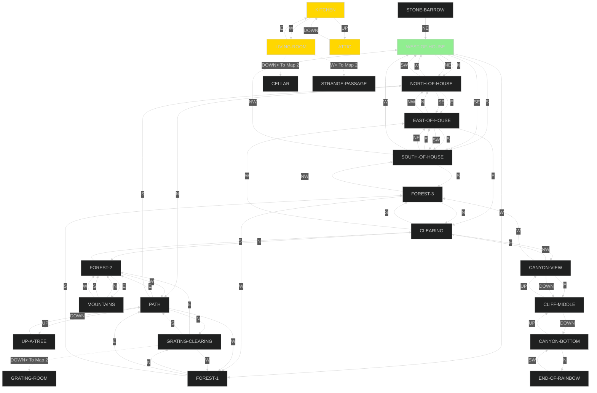
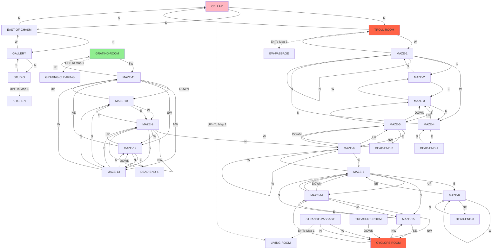
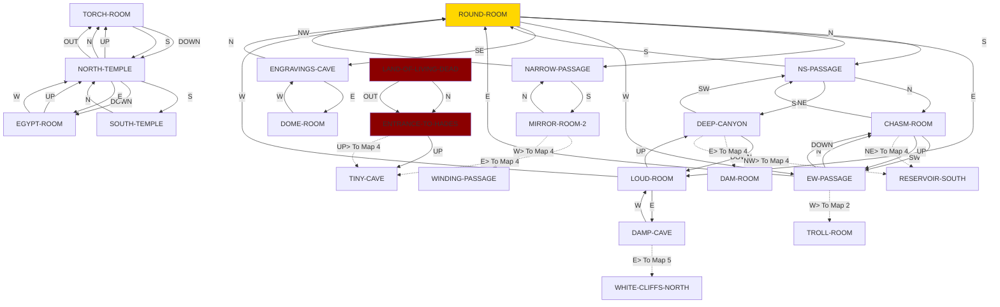
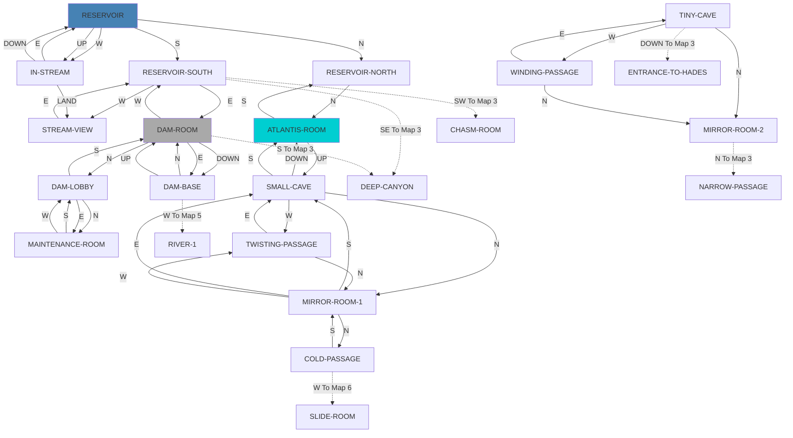
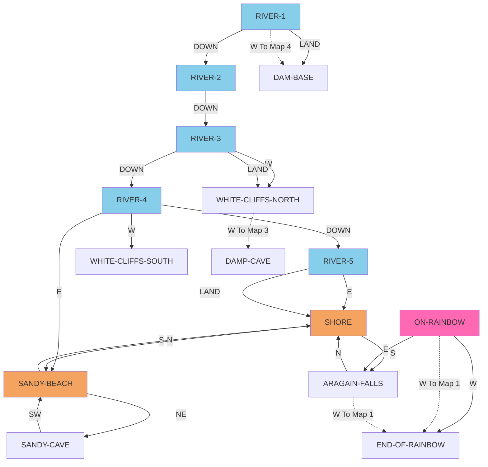
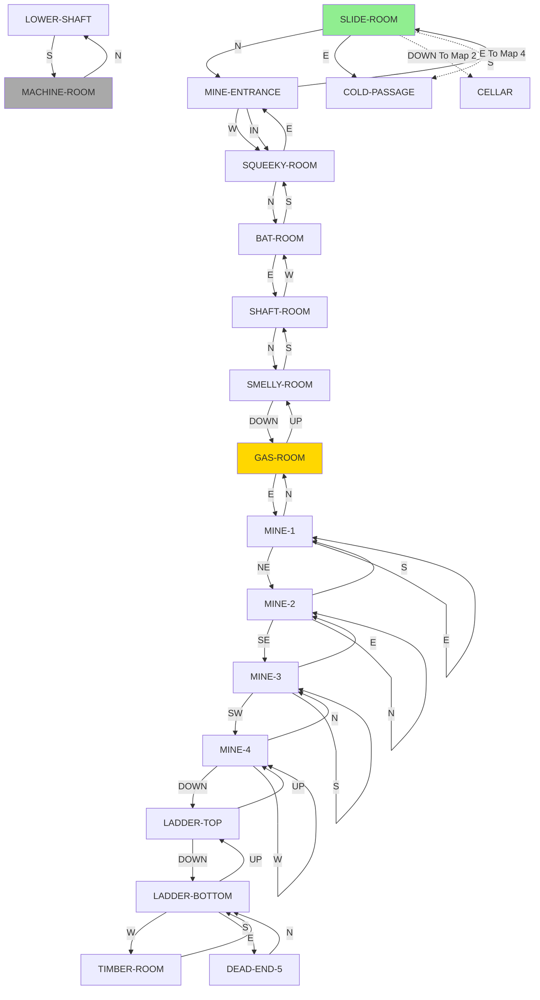

# ZORK I MAP ANALYSIS

## MAP DIVISIONS (6 maps, ~15-20 rooms each):

   - MAP 1: ABOVE GROUND - HOUSE & FOREST (20 rooms)
   - MAP 2: CELLAR, GALLERY, MAZE, & CYCLOPS AREA (28 rooms)
   - MAP 3: ROUND ROOM AREA & TEMPLES (17 rooms)
   - MAP 4: RESERVOIR & DAM AREA (16 rooms)
   - MAP 5: RIVER AREA (17 rooms)
   - MAP 6: COAL MINE AREA (12 rooms)

  
### MAP 1: ABOVE GROUND - HOUSE & FOREST AREA (20 rooms)
 
   - WEST-OF-HOUSE
     >NORTH -> NORTH-OF-HOUSE
     >SOUTH -> SOUTH-OF-HOUSE
     >NE -> NORTH-OF-HOUSE
     >SE -> SOUTH-OF-HOUSE
     >WEST -> FOREST-1
     >SW -> STONE-BARROW (conditional: IF WON-FLAG)
     >IN -> STONE-BARROW (conditional: IF WON-FLAG)

   - STONE-BARROW
     >NE -> WEST-OF-HOUSE

   - NORTH-OF-HOUSE
     >SW -> WEST-OF-HOUSE
     >SE -> EAST-OF-HOUSE
     >WEST -> WEST-OF-HOUSE
     >EAST -> EAST-OF-HOUSE
     >NORTH -> PATH

   - SOUTH-OF-HOUSE
     >WEST -> WEST-OF-HOUSE
     >EAST -> EAST-OF-HOUSE
     >NE -> EAST-OF-HOUSE
     >NW -> WEST-OF-HOUSE
     >SOUTH -> FOREST-3

   - EAST-OF-HOUSE
     >NORTH -> NORTH-OF-HOUSE
     >SOUTH -> SOUTH-OF-HOUSE
     >SW -> SOUTH-OF-HOUSE
     >NW -> NORTH-OF-HOUSE
     >EAST -> CLEARING
     >WEST -> KITCHEN (conditional: IF KITCHEN-WINDOW IS OPEN)
     >IN -> KITCHEN (conditional: IF KITCHEN-WINDOW IS OPEN)

   - FOREST-1
     >NORTH -> GRATING-CLEARING
     >EAST -> PATH
     >SOUTH -> FOREST-3

   - FOREST-2
     >EAST -> MOUNTAINS
     >SOUTH -> CLEARING
     >WEST -> PATH

   - MOUNTAINS
     >NORTH -> FOREST-2
     >SOUTH -> FOREST-2
     >WEST -> FOREST-2

   - FOREST-3
     >NORTH -> CLEARING
     >WEST -> FOREST-1
     >NW -> SOUTH-OF-HOUSE

   - PATH
     >UP -> UP-A-TREE
     >NORTH -> GRATING-CLEARING
     >EAST -> FOREST-2
     >SOUTH -> NORTH-OF-HOUSE
     >WEST -> FOREST-1

   - UP-A-TREE
     >DOWN -> PATH

   - GRATING-CLEARING
     >EAST -> FOREST-2
     >WEST -> FOREST-1
     >SOUTH -> PATH
     >DOWN -> GRATING-ROOM (conditional via PER GRATING-EXIT)

   - CLEARING
     >EAST -> CANYON-VIEW
     >NORTH -> FOREST-2
     >SOUTH -> FOREST-3
     >WEST -> EAST-OF-HOUSE

   - KITCHEN
     >EAST -> EAST-OF-HOUSE (conditional: IF KITCHEN-WINDOW IS OPEN)
     >WEST -> LIVING-ROOM
     >OUT -> EAST-OF-HOUSE (conditional: IF KITCHEN-WINDOW IS OPEN)
     >UP -> ATTIC

   - ATTIC
     >DOWN -> KITCHEN

   - LIVING-ROOM
     >EAST -> KITCHEN
     >WEST -> STRANGE-PASSAGE (conditional: IF MAGIC-FLAG)
     >DOWN -> CELLAR (conditional via PER TRAP-DOOR-EXIT)

   - CANYON-VIEW
     >EAST -> CLIFF-MIDDLE
     >DOWN -> CLIFF-MIDDLE
     >NW -> CLEARING
     >WEST -> FOREST-3

   - CLIFF-MIDDLE
     >UP -> CANYON-VIEW
     >DOWN -> CANYON-BOTTOM

   - CANYON-BOTTOM
     >UP -> CLIFF-MIDDLE
     >NORTH -> END-OF-RAINBOW

   - END-OF-RAINBOW
     >UP -> ON-RAINBOW (conditional: IF RAINBOW-FLAG)
     >NE -> ON-RAINBOW (conditional: IF RAINBOW-FLAG)
     >EAST -> ON-RAINBOW (conditional: IF RAINBOW-FLAG)
     >SW -> CANYON-BOTTOM

### MAP 2: CELLAR, GALLERY, MAZE, & CYCLOPS AREA (28 rooms)

   - CELLAR
     >NORTH -> TROLL-ROOM
     >SOUTH -> EAST-OF-CHASM
     >UP -> LIVING-ROOM (conditional: IF TRAP-DOOR IS OPEN)

   - TROLL-ROOM
     >SOUTH -> CELLAR
     >EAST -> EW-PASSAGE (conditional: IF TROLL-FLAG)
     >WEST -> MAZE-1 (conditional: IF TROLL-FLAG)

   - EAST-OF-CHASM
     >NORTH -> CELLAR
     >EAST -> GALLERY

   - GALLERY
     >WEST -> EAST-OF-CHASM
     >NORTH -> STUDIO

   - STUDIO
     >SOUTH -> GALLERY
     >UP -> KITCHEN (conditional via PER UP-CHIMNEY-FUNCTION)

   - MAZE-1
     >EAST -> TROLL-ROOM
     >NORTH -> MAZE-1
     >SOUTH -> MAZE-2
     >WEST -> MAZE-4

   - MAZE-2
     >SOUTH -> MAZE-1
     >DOWN -> MAZE-4 (conditional via PER MAZE-DIODES)
     >EAST -> MAZE-3

   - MAZE-3
     >WEST -> MAZE-2
     >NORTH -> MAZE-4
     >UP -> MAZE-5

   - MAZE-4
     >WEST -> MAZE-3
     >NORTH -> MAZE-1
     >EAST -> DEAD-END-1

   - DEAD-END-1
     >SOUTH -> MAZE-4

   - MAZE-5
     >EAST -> DEAD-END-2
     >NORTH -> MAZE-3
     >SW -> MAZE-6

   - DEAD-END-2
     >WEST -> MAZE-5

   - MAZE-6
     >DOWN -> MAZE-5
     >EAST -> MAZE-7
     >WEST -> MAZE-6
     >UP -> MAZE-9

   - MAZE-7
     >UP -> MAZE-14
     >WEST -> MAZE-6
     >DOWN -> DEAD-END-1 (conditional via PER MAZE-DIODES)
     >EAST -> MAZE-8
     >SOUTH -> MAZE-15

   - MAZE-8
     >NE -> MAZE-7
     >WEST -> MAZE-8
     >SE -> DEAD-END-3

   - DEAD-END-3
     >NORTH -> MAZE-8

   - MAZE-9
     >NORTH -> MAZE-6
     >DOWN -> MAZE-11 (conditional via PER MAZE-DIODES)
     >EAST -> MAZE-10
     >SOUTH -> MAZE-13
     >WEST -> MAZE-12
     >NW -> MAZE-9

   - MAZE-10
     >EAST -> MAZE-9
     >WEST -> MAZE-13
     >UP -> MAZE-11

   - MAZE-11
     >NE -> GRATING-ROOM
     >DOWN -> MAZE-10
     >NW -> MAZE-13
     >SW -> MAZE-12

   - GRATING-ROOM
     >SW -> MAZE-11
     >UP -> GRATING-CLEARING (conditional: IF GRATE IS OPEN)

   - MAZE-12
     >DOWN -> MAZE-5 (conditional via PER MAZE-DIODES)
     >SW -> MAZE-11
     >EAST -> MAZE-13
     >UP -> MAZE-9
     >NORTH -> DEAD-END-4

   - DEAD-END-4
     >SOUTH -> MAZE-12

   - MAZE-13
     >EAST -> MAZE-9
     >DOWN -> MAZE-12
     >SOUTH -> MAZE-10
     >WEST -> MAZE-11

   - MAZE-14
     >WEST -> MAZE-15
     >NW -> MAZE-14
     >NE -> MAZE-7
     >SOUTH -> MAZE-7

   - MAZE-15
     >WEST -> MAZE-14
     >SOUTH -> MAZE-7
     >SE -> CYCLOPS-ROOM

   - CYCLOPS-ROOM
     >NW -> MAZE-15
     >EAST -> STRANGE-PASSAGE (conditional: IF MAGIC-FLAG)
     >UP -> TREASURE-ROOM (conditional: IF CYCLOPS-FLAG)

   - STRANGE-PASSAGE
     >WEST -> CYCLOPS-ROOM
     >IN -> CYCLOPS-ROOM
     >EAST -> LIVING-ROOM

   - TREASURE-ROOM
     >DOWN -> CYCLOPS-ROOM

### MAP 3: ROUND ROOM AREA, TEMPLES, & HADES (17 rooms)

   - EW-PASSAGE
     >EAST -> ROUND-ROOM
     >WEST -> TROLL-ROOM
     >DOWN -> CHASM-ROOM
     >NORTH -> CHASM-ROOM

   - ROUND-ROOM
     >EAST -> LOUD-ROOM
     >WEST -> EW-PASSAGE
     >NORTH -> NS-PASSAGE
     >SOUTH -> NARROW-PASSAGE
     >SE -> ENGRAVINGS-CAVE

   - LOUD-ROOM
     >EAST -> DAMP-CAVE
     >WEST -> ROUND-ROOM
     >UP -> DEEP-CANYON

   - DAMP-CAVE
     >WEST -> LOUD-ROOM
     >EAST -> WHITE-CLIFFS-NORTH

   - NS-PASSAGE
     >NORTH -> CHASM-ROOM
     >NE -> DEEP-CANYON
     >SOUTH -> ROUND-ROOM

   - CHASM-ROOM
     >NE -> RESERVOIR-SOUTH
     >SW -> EW-PASSAGE
     >UP -> EW-PASSAGE
     >SOUTH -> NS-PASSAGE

   - DEEP-CANYON
     >NW -> RESERVOIR-SOUTH
     >EAST -> DAM-ROOM
     >SW -> NS-PASSAGE
     >DOWN -> LOUD-ROOM

   - ENGRAVINGS-CAVE
     >NW -> ROUND-ROOM
     >EAST -> DOME-ROOM

   - DOME-ROOM
     >WEST -> ENGRAVINGS-CAVE
     >DOWN -> TORCH-ROOM (conditional: IF DOME-FLAG)

   - TORCH-ROOM
     >SOUTH -> NORTH-TEMPLE
     >DOWN -> NORTH-TEMPLE

   - NORTH-TEMPLE
     >DOWN -> EGYPT-ROOM
     >EAST -> EGYPT-ROOM
     >NORTH -> TORCH-ROOM
     >OUT -> TORCH-ROOM
     >UP -> TORCH-ROOM
     >SOUTH -> SOUTH-TEMPLE

   - EGYPT-ROOM
     >WEST -> NORTH-TEMPLE
     >UP -> NORTH-TEMPLE

   - SOUTH-TEMPLE
     >NORTH -> NORTH-TEMPLE
     >DOWN -> TINY-CAVE (conditional: IF COFFIN-CURE)

   - ENTRANCE-TO-HADES
     >UP -> TINY-CAVE
     >IN -> LAND-OF-LIVING-DEAD (conditional: IF LLD-FLAG)
     >SOUTH -> LAND-OF-LIVING-DEAD (conditional: IF LLD-FLAG)

   - LAND-OF-LIVING-DEAD
     >OUT -> ENTRANCE-TO-HADES
     >NORTH -> ENTRANCE-TO-HADES

   - MIRROR-ROOM-1
     >NORTH -> COLD-PASSAGE
     >WEST -> TWISTING-PASSAGE
     >EAST -> SMALL-CAVE

   - MIRROR-ROOM-2
     >WEST -> WINDING-PASSAGE
     >NORTH -> NARROW-PASSAGE
     >EAST -> TINY-CAVE

### MAP 4: RESERVOIR & DAM AREA (16 rooms)

   - RESERVOIR-SOUTH
     >SE -> DEEP-CANYON
     >SW -> CHASM-ROOM
     >EAST -> DAM-ROOM
     >WEST -> STREAM-VIEW
     >NORTH -> RESERVOIR (conditional: IF LOW-TIDE)

   - RESERVOIR
     >NORTH -> RESERVOIR-NORTH
     >SOUTH -> RESERVOIR-SOUTH
     >UP -> IN-STREAM
     >WEST -> IN-STREAM

   - RESERVOIR-NORTH
     >NORTH -> ATLANTIS-ROOM
     >SOUTH -> RESERVOIR (conditional: IF LOW-TIDE)

   - STREAM-VIEW
     >EAST -> RESERVOIR-SOUTH

   - IN-STREAM
     >LAND -> STREAM-VIEW
     >DOWN -> RESERVOIR
     >EAST -> RESERVOIR

   - DAM-ROOM
     >SOUTH -> DEEP-CANYON
     >DOWN -> DAM-BASE
     >EAST -> DAM-BASE
     >NORTH -> DAM-LOBBY
     >WEST -> RESERVOIR-SOUTH

   - DAM-LOBBY
     >SOUTH -> DAM-ROOM
     >NORTH -> MAINTENANCE-ROOM
     >EAST -> MAINTENANCE-ROOM

   - MAINTENANCE-ROOM
     >SOUTH -> DAM-LOBBY
     >WEST -> DAM-LOBBY

   - DAM-BASE
     >NORTH -> DAM-ROOM
     >UP -> DAM-ROOM

   - SMALL-CAVE
     >NORTH -> MIRROR-ROOM-1
     >DOWN -> ATLANTIS-ROOM
     >SOUTH -> ATLANTIS-ROOM
     >WEST -> TWISTING-PASSAGE

   - TINY-CAVE
     >NORTH -> MIRROR-ROOM-2
     >WEST -> WINDING-PASSAGE
     >DOWN -> ENTRANCE-TO-HADES

   - COLD-PASSAGE
     >SOUTH -> MIRROR-ROOM-1
     >WEST -> SLIDE-ROOM

   - NARROW-PASSAGE
     >NORTH -> ROUND-ROOM
     >SOUTH -> MIRROR-ROOM-2

   - WINDING-PASSAGE
     >NORTH -> MIRROR-ROOM-2
     >EAST -> TINY-CAVE

   - TWISTING-PASSAGE
     >NORTH -> MIRROR-ROOM-1
     >EAST -> SMALL-CAVE

   - ATLANTIS-ROOM
     >UP -> SMALL-CAVE
     >SOUTH -> RESERVOIR-NORTH

### MAP 5: RIVER AREA (17 rooms)

   - RIVER-1
     >WEST -> DAM-BASE
     >LAND -> DAM-BASE
     >DOWN -> RIVER-2

   - RIVER-2
     >DOWN -> RIVER-3

   - RIVER-3
     >DOWN -> RIVER-4
     >LAND -> WHITE-CLIFFS-NORTH
     >WEST -> WHITE-CLIFFS-NORTH

   - WHITE-CLIFFS-NORTH
     >SOUTH -> WHITE-CLIFFS-SOUTH (conditional: IF DEFLATE)
     >WEST -> DAMP-CAVE (conditional: IF DEFLATE)

   - WHITE-CLIFFS-SOUTH
     >NORTH -> WHITE-CLIFFS-NORTH (conditional: IF DEFLATE)

   - RIVER-4
     >DOWN -> RIVER-5
     >WEST -> WHITE-CLIFFS-SOUTH
     >EAST -> SANDY-BEACH

   - RIVER-5
     >EAST -> SHORE
     >LAND -> SHORE

   - SHORE
     >NORTH -> SANDY-BEACH
     >SOUTH -> ARAGAIN-FALLS

   - SANDY-BEACH
     >NE -> SANDY-CAVE
     >SOUTH -> SHORE

   - SANDY-CAVE
     >SW -> SANDY-BEACH

   - ARAGAIN-FALLS
     >WEST -> ON-RAINBOW (conditional: IF RAINBOW-FLAG)
     >NORTH -> SHORE
     >UP -> ON-RAINBOW (conditional: IF RAINBOW-FLAG)

   - ON-RAINBOW
     >WEST -> END-OF-RAINBOW
     >EAST -> ARAGAIN-FALLS

### MAP 6: COAL MINE AREA (12 rooms)

   - SLIDE-ROOM
     >EAST -> COLD-PASSAGE
     >NORTH -> MINE-ENTRANCE
     >DOWN -> CELLAR

   - MINE-ENTRANCE
     >SOUTH -> SLIDE-ROOM
     >IN -> SQUEEKY-ROOM
     >WEST -> SQUEEKY-ROOM

   - SQUEEKY-ROOM
     >NORTH -> BAT-ROOM
     >EAST -> MINE-ENTRANCE

   - BAT-ROOM
     >SOUTH -> SQUEEKY-ROOM
     >EAST -> SHAFT-ROOM

   - SHAFT-ROOM
     >WEST -> BAT-ROOM
     >NORTH -> SMELLY-ROOM

   - SMELLY-ROOM
     >DOWN -> GAS-ROOM
     >SOUTH -> SHAFT-ROOM

   - GAS-ROOM
     >UP -> SMELLY-ROOM
     >EAST -> MINE-1

   - MINE-1
     >NORTH -> GAS-ROOM
     >EAST -> MINE-1
     >NE -> MINE-2

   - MINE-2
     >NORTH -> MINE-2
     >SOUTH -> MINE-1
     >SE -> MINE-3

   - MINE-3
     >SOUTH -> MINE-3
     >SW -> MINE-4
     >EAST -> MINE-2

   - MINE-4
     >NORTH -> MINE-3
     >WEST -> MINE-4
     >DOWN -> LADDER-TOP

   - LADDER-TOP
     >DOWN -> LADDER-BOTTOM
     >UP -> MINE-4

   - LADDER-BOTTOM
     >SOUTH -> DEAD-END-5
     >WEST -> TIMBER-ROOM
     >UP -> LADDER-TOP

   - DEAD-END-5
     >NORTH -> LADDER-BOTTOM

   - TIMBER-ROOM
     >EAST -> LADDER-BOTTOM
     >WEST -> LOWER-SHAFT (conditional: IF EMPTY-HANDED)

   - LOWER-SHAFT
     >SOUTH -> MACHINE-ROOM
     >OUT -> TIMBER-ROOM (conditional: IF EMPTY-HANDED)
     >EAST -> TIMBER-ROOM (conditional: IF EMPTY-HANDED)

   - MACHINE-ROOM
     >NORTH -> LOWER-SHAFT

---

## 9. World Maps - Room Connections

The following maps show the 110 rooms in Zork I and their directional connections. The game world has been divided into 6 geographic areas for clarity.

### Map 1: Above Ground - House & Forest Area

This map shows the surface world around the White House and surrounding forest.

**Key locations:**
- **WEST-OF-HOUSE**: Starting location of the game
- **LIVING-ROOM**: Entrance to the house, connects to underground via cellar
- **GRATING-CLEARING**: Surface entrance to underground via grating

---

### Map 2: Cellar, Gallery, Maze & Cyclops Area

This map shows the maze complex and the areas accessible from the cellar.

**Key locations:**
- **CELLAR**: Main entrance from Living Room
- **TROLL-ROOM**: Guarded by troll, gateway to maze
- **MAZE-1 to MAZE-15**: Confusing maze with self-loops and dead ends
- **CYCLOPS-ROOM**: Boss area with cyclops
- **GRATING-ROOM**: Exit from maze to surface

---

### Map 3: Round Room, Temples & Hades Area

This map shows the central hub (Round Room) and the temple complex.

**Key locations:**
- **ROUND-ROOM**: Central hub with exits in all cardinal directions
- **TORCH-ROOM**: Temple area entrance
- **ENTRANCE-TO-HADES**: Gateway to the underworld
- **LAND-OF-LIVING-DEAD**: Deepest point in Hades

---

### Map 4: Reservoir & Dam Area

This map shows the water management system and mirror room passages.

**Key locations:**
- **RESERVOIR**: Main water storage area
- **DAM-ROOM**: Control area for the dam
- **ATLANTIS-ROOM**: Legendary sunken city (accessible when reservoir is empty)
- **MIRROR-ROOM-1**: Mirror passage connecting to Atlantis area

---

### Map 5: Frigid River & Shore Area

This map shows the river journey from the dam to the shore and waterfall.

**Key locations:**
- **RIVER-1 to RIVER-5**: The Frigid River flowing from dam to shore
- **SHORE**: Sandy beach at the end of the river
- **ARAGAIN-FALLS**: Spectacular waterfall
- **ON-RAINBOW**: Standing on the rainbow above the falls

---

### Map 6: Coal Mine Area

This map shows the coal mine complex with its tunnels, shafts, and machinery.

**Key locations:**
- **SLIDE-ROOM**: Main entrance to coal mine from cellar
- **MINE-ENTRANCE**: Entry point to the mine tunnels
- **GAS-ROOM**: Dangerous area with coal gas
- **MINE-1 to MINE-4**: Coal mine tunnels with self-loops
- **MACHINE-ROOM**: Bottom of the mine with machinery

---

## Map Summary

The Zork I world consists of **110 interconnected rooms** organized into 6 distinct geographic areas:

1. **Map 1** (20 rooms): Surface world with the White House, forest, and canyon
2. **Map 2** (28 rooms): Underground maze complex and gallery
3. **Map 3** (17 rooms): Central Round Room hub, temples, and Hades
4. **Map 4** (16 rooms): Reservoir system, dam, and Atlantis
5. **Map 5** (12 rooms): Frigid River flowing to shore and waterfall
6. **Map 6** (17 rooms): Coal mine tunnels and machinery

**Navigation notes:**
- Dotted lines (`.->`) indicate connections between maps
- Many rooms have conditional exits based on game state (flags, objects, etc.)
- The maze (Map 2) contains self-referencing exits that make navigation confusing
- Some mine tunnels (Map 6) also have self-loops for disorientation
