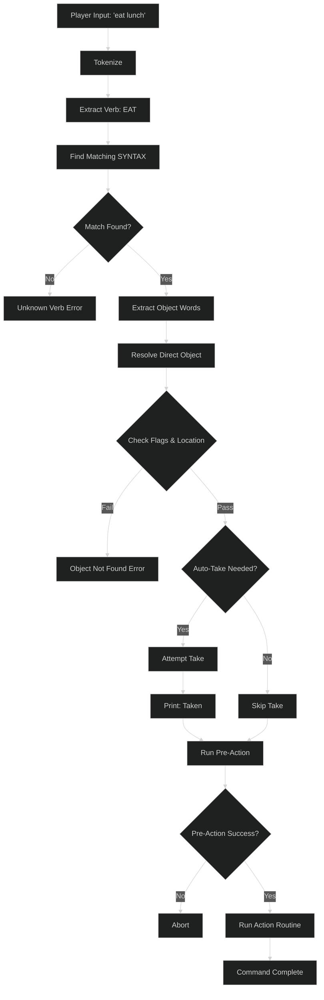

# SYNTAX Rule System in Zork I

This document explains how Zork I's **SYNTAX** system works - the declarative way of defining verb grammar, constraints, and actions.

---

## Table of Contents

1. [Overview](#overview)
2. [SYNTAX Declaration Format](#syntax-declaration-format)
3. [Python Pseudocode Implementation](#python-pseudocode-implementation)
4. [Location Constraints Deep Dive](#location-constraints-deep-dive)
5. [Real Examples from Zork I](#real-examples-from-zork-i)
6. [How the Parser Uses SYNTAX Rules](#how-the-parser-uses-syntax-rules)

---

## Overview

The **SYNTAX** system is Zork's declarative way of defining:

1. **What verbs exist** and their synonyms
2. **What objects they operate on** (direct and indirect)
3. **What constraints** those objects must satisfy
4. **What action routine** to call when matched

This separates **grammar definition** (SYNTAX) from **implementation** (verb routines), making the codebase more maintainable.

### Example

```zil
<SYNTAX TAKE OBJECT (FIND TAKEBIT) (ON-GROUND IN-ROOM) = V-TAKE PRE-TAKE>
```

This single line defines:
- **Verb**: TAKE
- **Direct object**: Must have TAKEBIT flag
- **Location**: Must be ON-GROUND or IN-ROOM
- **Action**: Call V-TAKE
- **Pre-action**: Call PRE-TAKE first

---

## SYNTAX Declaration Format

### Basic Structure

```zil
<SYNTAX VERB-NAME
        [OBJECT-SPEC]
        [PREPOSITION OBJECT-SPEC]
        = ACTION-ROUTINE [PRE-ACTION]>
```

### Components

#### 1. Verb and Synonyms

```zil
<SYNTAX TAKE ...>               ; Primary verb
<SYNTAX EXAMINE ...>            ; Primary verb
```

Synonyms are defined separately:
```zil
<VERB-SYNONYM TAKE GET HOLD CARRY REMOVE GRAB CATCH>
<VERB-SYNONYM EXAMINE DESCRIBE WHAT WHATS>
```

#### 2. Object Specifications

**Direct Object:**
```zil
<SYNTAX TAKE OBJECT (constraints) = ...>
```

**Direct + Indirect Object:**
```zil
<SYNTAX PUT OBJECT (constraints) IN OBJECT (constraints) = ...>
```

**No Objects:**
```zil
<SYNTAX INVENTORY = V-INVENTORY>
```

#### 3. Constraint Types

**Flag Constraints** (FIND):
```zil
OBJECT (FIND TAKEBIT)           ; Must have TAKEBIT
OBJECT (FIND WEAPONBIT)         ; Must have WEAPONBIT
OBJECT (FIND ACTORBIT)          ; Must be an actor
```

**Location Constraints**:
```zil
OBJECT (HELD CARRIED)           ; In player's inventory
OBJECT (ON-GROUND IN-ROOM)      ; In current room
OBJECT (HELD CARRIED ON-GROUND IN-ROOM TAKE)  ; Anywhere, auto-take
```

**Multiple Objects** (MANY):
```zil
OBJECT (MANY HELD HAVE)         ; Can take ALL
```

#### 4. Prepositions

```zil
<SYNTAX PUT OBJECT IN OBJECT = V-PUT>       ; IN
<SYNTAX PUT OBJECT ON OBJECT = V-PUT-ON>    ; ON
<SYNTAX ATTACK OBJECT WITH OBJECT = ...>    ; WITH
<SYNTAX GIVE OBJECT TO OBJECT = V-GIVE>     ; TO
```

#### 5. Action Routines

**Action only:**
```zil
= V-TAKE
```

**Pre-action + Action:**
```zil
= V-TAKE PRE-TAKE
```

The pre-action runs first and can block the main action.

---

## Python Pseudocode Implementation

Here's how the SYNTAX system would be implemented in Python:

### Core Data Structures

```python
from dataclasses import dataclass
from typing import List, Optional, Callable
from enum import IntFlag

# Bit flags for location constraints
class LocationBits(IntFlag):
    SHAVE = 2      # HELD/HAVE/CARRIED - in inventory
    SMANY = 4      # MANY - allow multiple objects
    STAKE = 8      # TAKE - auto-take if not held
    SOG = 16       # ON-GROUND - on room floor
    SIR = 32       # IN-ROOM - visible in room
    SC = 64        # Search containers
    SH = 128       # Search here

@dataclass
class ObjectSpec:
    """Specification for an object in a SYNTAX rule"""

    # Flag requirements (FIND TAKEBIT, etc.)
    required_flags: List[str] = None

    # Location constraints (HELD, ON-GROUND, etc.)
    location_bits: int = 0

    # Allow multiple objects (ALL)
    many: bool = False

    # Auto-take if not held
    auto_take: bool = False

    def __init__(self, flags=None, location=None, many=False):
        """
        Create object specification

        Args:
            flags: List of required flags (e.g., [TAKEBIT, WEAPONBIT])
            location: List of location constraints (e.g., ["HELD", "IN_ROOM"])
            many: Allow multiple objects
        """
        self.required_flags = flags or []
        self.many = many
        self.location_bits = 0
        self.auto_take = False

        # Parse location constraints into bit flags
        if location:
            for loc in location:
                if loc in ["HELD", "HAVE", "CARRIED"]:
                    self.location_bits |= LocationBits.SHAVE
                elif loc == "ON_GROUND" or loc == "ON-GROUND":
                    self.location_bits |= LocationBits.SOG
                elif loc == "IN_ROOM" or loc == "IN-ROOM":
                    self.location_bits |= LocationBits.SIR
                elif loc == "TAKE":
                    self.location_bits |= LocationBits.STAKE
                    self.auto_take = True
                elif loc == "MANY":
                    self.location_bits |= LocationBits.SMANY
                    self.many = True


@dataclass
class SyntaxRule:
    """
    Defines grammar for a single verb command

    Example:
        SyntaxRule(
            verb="TAKE",
            synonyms=["GET", "HOLD"],
            direct_object=ObjectSpec(flags=[TAKEBIT], location=["ON_GROUND", "IN_ROOM"]),
            action=v_take,
            pre_action=pre_take
        )
    """

    # Primary verb name
    verb: str

    # Verb synonyms
    synonyms: List[str] = None

    # Direct object specification (PRSO)
    direct_object: Optional[ObjectSpec] = None

    # Preposition (IN, ON, WITH, TO, etc.)
    preposition: Optional[str] = None

    # Indirect object specification (PRSI)
    indirect_object: Optional[ObjectSpec] = None

    # Action routine to call
    action: Callable

    # Pre-action routine (optional)
    pre_action: Optional[Callable] = None

    def matches_command(self, verb: str, objects: List[str]) -> bool:
        """Check if this syntax rule matches the parsed command"""
        # Check verb matches
        if verb != self.verb and verb not in (self.synonyms or []):
            return False

        # Check object count matches
        expected_objects = 0
        if self.direct_object:
            expected_objects += 1
        if self.indirect_object:
            expected_objects += 1

        if len(objects) < expected_objects:
            return False

        return True


# Global syntax table
SYNTAX_TABLE = []

def define_syntax(rule: SyntaxRule):
    """Register a syntax rule"""
    SYNTAX_TABLE.append(rule)
```

### Parser Implementation

```python
class Parser:
    """Zork I parser using SYNTAX rules"""

    def __init__(self):
        self.syntax_table = SYNTAX_TABLE
        self.winner = PLAYER  # Current actor
        self.here = None      # Current room

    def parse_command(self, input_text: str):
        """
        Parse player input into action and objects

        Returns:
            (action, direct_obj, indirect_obj) or None if parse fails
        """
        # Step 1: Tokenize input
        tokens = self.tokenize(input_text)

        if not tokens:
            return None

        # Step 2: Extract verb
        verb = tokens[0].upper()

        # Step 3: Find matching syntax rule
        syntax = self.find_syntax(verb, tokens[1:])

        if not syntax:
            print(f"I don't understand '{verb}'.")
            return None

        # Step 4: Resolve objects using location constraints
        direct_obj = None
        indirect_obj = None

        if syntax.direct_object:
            direct_obj = self.resolve_object(
                tokens,
                syntax.direct_object,
                is_direct=True
            )
            if not direct_obj:
                return None

        if syntax.indirect_object:
            indirect_obj = self.resolve_object(
                tokens,
                syntax.indirect_object,
                is_direct=False
            )
            if not indirect_obj:
                return None

        # Step 5: Check auto-take
        if syntax.direct_object and syntax.direct_object.auto_take:
            if direct_obj and not self.held(direct_obj):
                self.auto_take(direct_obj)

        # Step 6: Execute pre-action
        if syntax.pre_action:
            if not syntax.pre_action(direct_obj, indirect_obj):
                return None  # Pre-action blocked

        # Step 7: Return action to execute
        return (syntax.action, direct_obj, indirect_obj)

    def find_syntax(self, verb: str, object_words: List[str]) -> Optional[SyntaxRule]:
        """Find syntax rule matching verb and object count"""
        for syntax in self.syntax_table:
            if syntax.matches_command(verb, object_words):
                return syntax
        return None

    def resolve_object(self, tokens: List[str], spec: ObjectSpec, is_direct: bool):
        """
        Resolve object name to actual object using location constraints

        This is where the two-phase search happens!
        """
        # Extract object name from tokens
        obj_name = self.extract_object_name(tokens, is_direct)

        # Phase 1: Search player's inventory (if HELD/CARRIED bits set)
        if spec.location_bits & LocationBits.SHAVE:
            obj = self.search_inventory(obj_name, spec)
            if obj:
                return obj

        # Phase 2: Search current room (if ON-GROUND/IN-ROOM bits set)
        if spec.location_bits & (LocationBits.SOG | LocationBits.SIR):
            obj = self.search_room(obj_name, spec)
            if obj:
                return obj

        # Not found
        print(f"You can't see any {obj_name} here!")
        return None

    def search_inventory(self, name: str, spec: ObjectSpec):
        """
        Search player's inventory for matching object

        This implements the SH (HELD) and SC (CARRIED) search
        """
        for obj in self.winner.children:
            if self.object_matches(obj, name, spec):
                return obj
        return None

    def search_room(self, name: str, spec: ObjectSpec):
        """
        Search current room for matching object

        This implements the SOG (ON-GROUND) and SIR (IN-ROOM) search
        """
        # Search room contents
        for obj in self.here.children:
            if self.object_matches(obj, name, spec):
                return obj

        # Search global objects (always visible)
        for obj in GLOBAL_OBJECTS.children:
            if self.object_matches(obj, name, spec):
                return obj

        # Search local-global objects (if room declares them)
        for obj in LOCAL_GLOBALS.children:
            if obj in self.here.global_objects:
                if self.object_matches(obj, name, spec):
                    return obj

        # If IN-ROOM, search open containers
        if spec.location_bits & LocationBits.SIR:
            for container in self.here.children:
                if container.has_flag(OPENBIT):
                    for obj in container.children:
                        if self.object_matches(obj, name, spec):
                            return obj

        return None

    def object_matches(self, obj, name: str, spec: ObjectSpec) -> bool:
        """Check if object matches name and constraints"""
        # Check name/synonym match
        if name.upper() not in [s.upper() for s in obj.synonyms]:
            return False

        # Check required flags
        for flag in spec.required_flags:
            if not obj.has_flag(flag):
                return False

        return True

    def held(self, obj) -> bool:
        """Check if object is in player's inventory"""
        return obj.location == self.winner

    def auto_take(self, obj):
        """Automatically take object (TAKE bit behavior)"""
        if obj.has_flag(TRYTAKEBIT):
            # Looks takeable but isn't - silently fail
            return

        # Try to take it
        if self.perform_take(obj):
            print("(Taken)")

    def tokenize(self, text: str) -> List[str]:
        """Split input into words"""
        return text.strip().split()

    def extract_object_name(self, tokens: List[str], is_direct: bool) -> str:
        """Extract object name from token list"""
        # Simplified - real parser handles adjectives, prepositions, etc.
        return " ".join(tokens)
```

### Example Usage

```python
# Define verbs
v_take = lambda obj, _: print(f"You take the {obj.description}.")
pre_take = lambda obj, _: obj.has_flag(TAKEBIT)

v_drop = lambda obj, _: print(f"You drop the {obj.description}.")

v_eat = lambda obj, _: print(f"You eat the {obj.description}.")

# Define syntax rules
define_syntax(SyntaxRule(
    verb="TAKE",
    synonyms=["GET", "HOLD", "CARRY", "GRAB"],
    direct_object=ObjectSpec(
        flags=[TAKEBIT],
        location=["ON_GROUND", "IN_ROOM"],
        many=True
    ),
    action=v_take,
    pre_action=pre_take
))

define_syntax(SyntaxRule(
    verb="DROP",
    synonyms=["RELEASE"],
    direct_object=ObjectSpec(
        location=["HELD", "MANY", "HAVE"]
    ),
    action=v_drop
))

define_syntax(SyntaxRule(
    verb="EAT",
    synonyms=["CONSUME"],
    direct_object=ObjectSpec(
        flags=[FOODBIT],
        location=["HELD", "CARRIED", "ON_GROUND", "IN_ROOM", "TAKE"]
    ),
    action=v_eat
))

define_syntax(SyntaxRule(
    verb="UNLOCK",
    direct_object=ObjectSpec(
        location=["ON_GROUND", "IN_ROOM"]
    ),
    preposition="WITH",
    indirect_object=ObjectSpec(
        flags=[TOOLBIT],
        location=["HELD", "CARRIED", "ON_GROUND", "IN_ROOM", "TAKE"]
    ),
    action=v_unlock
))

# Use parser
parser = Parser()
parser.here = LIVING_ROOM

# Parse commands
parser.parse_command("take lamp")      # Uses TAKE syntax
parser.parse_command("drop all")       # Uses DROP syntax
parser.parse_command("eat lunch")      # Uses EAT syntax (auto-takes)
parser.parse_command("unlock grate with key")  # Uses UNLOCK syntax
```

---

## Location Constraints Deep Dive

### Why Can't We Simplify to ["IN_ROOM", "TAKE"]?

**Question**: If `IN_ROOM` searches everywhere visible (inventory + room), why specify `["HELD", "CARRIED", "ON_GROUND", "IN_ROOM", "TAKE"]`?

**Answer**: **Search order matters!** The parser does **two separate searches** in a specific priority order.

### The Two-Phase Search

From [gparser.zil:1074-1078](gparser.zil#L1074-L1078):

```python
# Phase 1: Search player's inventory FIRST
if location_bits & (LocationBits.SHAVE):  # HELD/CARRIED
    DO_SL(PLAYER, SH, SC)
    if found:
        return object

# Phase 2: Search current room SECOND
if location_bits & (LocationBits.SOG | LocationBits.SIR):  # ON-GROUND/IN-ROOM
    DO_SL(HERE, SOG, SIR)
    if found:
        return object
```

### Why This Matters: The Duplicate Object Problem

Imagine you have **two lamps**:
- Lamp #1 in your inventory
- Lamp #2 on the floor

#### With Explicit Search Order

```python
# Syntax: location=["HELD", "CARRIED", "ON_GROUND", "IN_ROOM", "TAKE"]

# Player types: > EAT LUNCH
#
# Search sequence:
# 1. Check HELD/CARRIED (inventory) → finds lunch in inventory ✓
# 2. Return immediately
#
# Result: Eats the lunch you're holding
```

#### Without Search Order (just IN_ROOM)

```python
# Syntax: location=["IN_ROOM", "TAKE"]

# Player types: > EAT LUNCH
#
# Search sequence:
# 1. Check IN_ROOM → finds BOTH lunches (inventory + room) ❌
# 2. Parser gets confused
#
# Result: "Which lunch do you mean, the one you're holding or the one on the table?"
```

### Implementation of Two-Phase Search

```python
def resolve_with_priority(name: str, location_bits: int) -> Object:
    """
    Resolve object name with priority-based search

    This is the key to why we need explicit location lists!
    """

    # Phase 1: INVENTORY FIRST (highest priority)
    if location_bits & LocationBits.SHAVE:  # HELD/CARRIED/HAVE
        obj = search_inventory(name)
        if obj:
            return obj  # Found in inventory - stop searching!

    # Phase 2: ROOM SECOND (lower priority)
    if location_bits & (LocationBits.SOG | LocationBits.SIR):  # ON-GROUND/IN-ROOM
        obj = search_room(name)
        if obj:
            return obj  # Found in room

    # Not found anywhere
    return None

def search_inventory(name: str) -> Object:
    """Search ONLY player's inventory"""
    for obj in PLAYER.children:
        if name in obj.synonyms:
            return obj
    return None

def search_room(name: str) -> Object:
    """Search room, globals, and open containers"""
    # Room contents
    for obj in HERE.children:
        if name in obj.synonyms:
            return obj

    # Global objects
    for obj in GLOBAL_OBJECTS.children:
        if name in obj.synonyms:
            return obj

    # Local-global objects
    for obj in LOCAL_GLOBALS.children:
        if obj in HERE.global_objects and name in obj.synonyms:
            return obj

    # Open containers
    for container in HERE.children:
        if container.has_flag(OPENBIT):
            for obj in container.children:
                if name in obj.synonyms:
                    return obj

    return None
```

### Benefits of Explicit Location Lists

**1. Priority Ordering:**
```python
# Inventory-first makes sense for most verbs
# You eat what you're holding before grabbing from table
location=["HELD", "CARRIED", "ON_GROUND", "IN_ROOM"]
```

**2. Prevents Ambiguity:**
```python
# Without explicit order:
> EAT LUNCH
Which lunch? (ambiguous with 2 lunches)

# With inventory-first:
> EAT LUNCH
(eats the one you're holding)
```

**3. Performance:**
```python
# Check small list (inventory) before large list (room + containers)
# Finds common case faster
```

**4. Code Clarity:**
```python
# Explicit list documents intent:
location=["HELD", "CARRIED", "ON_GROUND", "IN_ROOM", "TAKE"]
# Reads as: "Check inventory, then room, auto-take if needed"

# Compact but ambiguous:
location=["IN_ROOM", "TAKE"]
# Unclear search order
```

### Real Example: EAT Command

From [gsyntax.zil:186](gsyntax.zil#L186):

```python
syntax_eat = SyntaxRule(
    verb="EAT",
    direct_object=ObjectSpec(
        flags=[FOODBIT],
        location=["HELD", "CARRIED", "ON_GROUND", "IN_ROOM", "TAKE"]
    ),
    action=v_eat
)
```

**What happens:**

```python
> EAT LUNCH
# Step 1: Search inventory for lunch
#   → Not found
# Step 2: Search room for lunch
#   → Found on table!
# Step 3: TAKE bit triggers auto-take
#   → (Taken)
# Step 4: Execute v_eat
#   → Thank you very much.
```

**If we used just ["IN_ROOM", "TAKE"]:**

```python
> EAT LUNCH
# Step 1: Search entire visible space at once
#   → Finds lunch on table AND lunch in backpack (if you had two)
#   → Ambiguity!
# Step 2: Parser must ask "which lunch?"
#   → Annoying for player
```

### Conclusion on Location Constraints

**The redundancy is intentional!**

```python
# Full specification:
location=["HELD", "CARRIED", "ON_GROUND", "IN_ROOM"]

# Cannot be simplified to:
location=["IN_ROOM"]

# Because:
# 1. Loses search priority (inventory-first)
# 2. Causes ambiguity with duplicate objects
# 3. Reduces performance (searches everything at once)
# 4. Less clear intent
```

This is a case where **explicit is better than implicit** - the redundancy serves a purpose!

---

## Real Examples from Zork I

### 1. Simple Verb (No Objects)

```python
syntax_inventory = SyntaxRule(
    verb="INVENTORY",
    synonyms=["I"],
    action=v_inventory
)
```

**Usage:**
```
> INVENTORY
You are carrying:
  A brass lantern
  An elvish sword
```

### 2. Single Object (Direct Only)

```python
syntax_examine = SyntaxRule(
    verb="EXAMINE",
    synonyms=["DESCRIBE", "WHAT", "WHATS", "LOOK"],
    direct_object=ObjectSpec(
        location=["HELD", "CARRIED", "IN_ROOM", "ON_GROUND"],
        many=True
    ),
    action=v_examine
)
```

**Usage:**
```
> EXAMINE SKULL
Lying in one corner of the room is a beautifully carved crystal skull.

> EXAMINE ALL
brass lantern: A battery-powered brass lantern.
elvish sword: An elvish sword of great antiquity.
```

### 3. Two Objects with Preposition

```python
syntax_put_in = SyntaxRule(
    verb="PUT",
    direct_object=ObjectSpec(
        location=["HELD", "MANY", "HAVE"]
    ),
    preposition="IN",
    indirect_object=ObjectSpec(
        flags=[CONTBIT],
        location=["HELD", "CARRIED", "ON_GROUND", "IN_ROOM"]
    ),
    action=v_put,
    pre_action=pre_put
)
```

**Usage:**
```
> PUT SWORD IN SACK
Done.

> PUT ALL IN CASE
brass lantern: Done.
rope: Done.
```

### 4. Complex Constraints

```python
syntax_attack_with = SyntaxRule(
    verb="ATTACK",
    synonyms=["FIGHT", "HURT", "INJURE", "HIT", "KILL"],
    direct_object=ObjectSpec(
        flags=[ACTORBIT],
        location=["ON_GROUND", "IN_ROOM"]
    ),
    preposition="WITH",
    indirect_object=ObjectSpec(
        flags=[WEAPONBIT],
        location=["HELD", "CARRIED", "HAVE"]
    ),
    action=v_attack
)
```

**Usage:**
```
> ATTACK TROLL WITH SWORD
(sword must be held, troll must be in room, troll must have ACTORBIT)
You swing the sword at the troll...

> ATTACK TROLL WITH LAMP
(lamp doesn't have WEAPONBIT)
Attacking with the brass lantern is not very effective.
```

### 5. Auto-Take Behavior

```python
syntax_read = SyntaxRule(
    verb="READ",
    direct_object=ObjectSpec(
        flags=[READBIT],
        location=["HELD", "CARRIED", "ON_GROUND", "IN_ROOM", "TAKE"]
    ),
    action=v_read
)
```

**Usage:**
```
> READ BOOK
(book on table, auto-takes it)
(Taken)
The book describes an ancient ritual...

> READ LEAFLET
(leaflet already held)
WELCOME TO ZORK!
```

### 6. Lock/Unlock Pattern

```python
syntax_unlock = SyntaxRule(
    verb="UNLOCK",
    direct_object=ObjectSpec(
        location=["ON_GROUND", "IN_ROOM"]
    ),
    preposition="WITH",
    indirect_object=ObjectSpec(
        flags=[TOOLBIT],
        location=["HELD", "CARRIED", "ON_GROUND", "IN_ROOM", "TAKE"]
    ),
    action=v_unlock
)
```

**Usage:**
```
> UNLOCK GRATE WITH KEY
(key on floor, auto-takes it)
(Taken)
The grate is unlocked.

> UNLOCK DOOR WITH SWORD
(sword has WEAPONBIT but not TOOLBIT)
Can you unlock a door with an elvish sword?
```

---

## How the Parser Uses SYNTAX Rules

### Complete Parse Flow



### Step-by-Step Example

**Command:** `> EAT LUNCH`

**Step 1: Tokenize**
```python
tokens = ["EAT", "LUNCH"]
verb = "EAT"
object_words = ["LUNCH"]
```

**Step 2: Find SYNTAX Rule**
```python
# Search SYNTAX_TABLE for verb "EAT"
syntax = SyntaxRule(
    verb="EAT",
    direct_object=ObjectSpec(
        flags=[FOODBIT],
        location=["HELD", "CARRIED", "ON_GROUND", "IN_ROOM", "TAKE"]
    ),
    action=v_eat
)
```

**Step 3: Resolve Object with Location Constraints**
```python
# Phase 1: Check inventory (HELD/CARRIED)
lunch = search_inventory("LUNCH")  # Not found

# Phase 2: Check room (ON-GROUND/IN-ROOM)
lunch = search_room("LUNCH")  # Found on table!

# Check flags
if not lunch.has_flag(FOODBIT):
    print("You can't eat that!")
    abort()
```

**Step 4: Auto-Take (TAKE bit set)**
```python
if not held(lunch):
    take(lunch)
    print("(Taken)")
```

**Step 5: Execute Action**
```python
v_eat(lunch, None)
# Output: "Thank you very much. It really hit the spot."
```

### Error Handling Examples

**Wrong Flag:**
```
> EAT SWORD
(sword doesn't have FOODBIT)
You can't eat that!
```

**Wrong Location:**
```
> DROP LAMP
(lamp in room, not held)
You don't have the brass lantern.
```

**Object Not Found:**
```
> TAKE DRAGON
(dragon doesn't exist)
You can't see any dragon here!
```

**Ambiguous Object:**
```
> TAKE LAMP
(multiple lamps visible, not using MANY)
Which lamp do you mean, the brass lantern or the wooden lamp?
```

---

## Summary

The SYNTAX system provides:

1. **Declarative Grammar** - Define what commands exist without writing parsing code
2. **Automatic Validation** - Flags and location constraints checked automatically
3. **Search Priority** - Inventory-first prevents ambiguity
4. **Auto-Take** - Convenient TAKE bit for player-friendly behavior
5. **Extensibility** - Easy to add new verbs by adding SYNTAX rules

This separation of **grammar** (SYNTAX) from **implementation** (verb routines) makes Zork's codebase maintainable and the parser behavior consistent across all verbs.

The seemingly redundant location constraints like `["HELD", "CARRIED", "ON_GROUND", "IN_ROOM"]` are actually **intentional and necessary** for controlling search order and preventing ambiguity with duplicate objects!