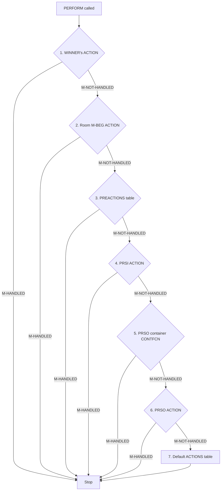

# Zork I Architecture Savepoint

**Last Updated:** 2025-12-13
**Purpose:** Comprehensive refresher on Zork's conversational adventure architecture

---

## Executive Summary

Zork I (1980) implements a sophisticated conversational adventure engine using ZIL (Zork Implementation Language), a LISP dialect. The architecture separates **grammar definition** (SYNTAX), **world state** (OBJECTS), **parsing** (GPARSER), and **action dispatch** (PERFORM) into distinct, composable systems.

**Key Innovation:** A declarative SYNTAX system that specifies verb grammar, object constraints, and search priority—eliminating the need for hand-coded parsers for each verb.

---

## 1. Core Architecture: The Conversation Flow

### How a Command Flows Through Zork

```
Player: "examine crystal skull"
    ↓
[LEXER] → Tokenize: [EXAMINE, CRYSTAL, SKULL]
    ↓
[SYNTAX MATCHER] → Match rule: "EXAMINE OBJECT (MANY)"
    ↓
[OBJECT RESOLVER] → Find object matching "skull" with adjective "crystal"
    ↓  (Two-phase search: inventory first, then room)
    ↓
[GLOBAL VARIABLES SET] → PRSA=V?EXAMINE, PRSO=SKULL, PRSI=<>
    ↓
[PERFORM DISPATCH] → Cascading handler chain:
    1. WINNER's action (player)
    2. Current ROOM's M-BEG action
    3. PREACTIONS table
    4. PRSI action (indirect object)
    5. PRSO container action
    6. PRSO action (SKULL)
    7. Default V-EXAMINE handler
    ↓
[OUTPUT] → "Lying in one corner of the room is a beautifully carved crystal skull..."
```

---

## 2. The Global State Machine

### Key Variables That Drive Conversation

| Variable | Meaning | Example Value |
|----------|---------|---------------|
| **PRSA** | **PR**imary **S**yntax/**A**ction | V?TAKE, V?EXAMINE, V?ATTACK |
| **PRSO** | **PR**imary **S**yntax/**O**bject (direct object) | LAMP, SKULL, TROLL |
| **PRSI** | **PR**imary **S**yntax/**I**ndirect object | SWORD (in "attack troll WITH SWORD") |
| **WINNER** | Current actor performing action | ADVENTURER (player) or NPC |
| **HERE** | Current location | KITCHEN, LIVING-ROOM, MAZE-5 |
| **LIT** | Is current room lit? | TRUE/FALSE |
| **P-IT-OBJECT** | Object referenced by "IT" pronoun | SKULL (after "examine skull") |

**Location:** gparser.zil (global variable declarations)

### The State Update Cycle

```python
# Every turn:
1. READ input from player
2. PARSE into tokens → P-LEXV (lexical vector)
3. MATCH syntax rule → Set PRSA
4. RESOLVE objects → Set PRSO, PRSI
5. PERFORM action → Cascade through handlers
6. UPDATE state (P-IT-OBJECT ← PRSO)
7. RUN daemons (CLOCKER)
8. LOOP
```

---

## 3. The SYNTAX System: Declarative Grammar

### Why SYNTAX Rules Matter

Instead of writing custom parsing code for each verb, Zork uses **declarative rules** that specify:
- What verbs exist (and their synonyms)
- What objects they operate on
- What constraints those objects must satisfy
- What action routine to call

### Example: The TAKE Command

```python
# From gsyntax.zil
syntax_take = SyntaxRule(
    verb="TAKE",
    synonyms=["GET", "HOLD", "CARRY", "REMOVE", "GRAB", "CATCH"],

    direct_object=ObjectSpec(
        flags=[TAKEBIT],                                    # Must be takeable
        location=["ON_GROUND", "IN_ROOM"],                  # Search order
        many=True                                           # Allow "TAKE ALL"
    ),

    action=v_take,                                          # Handler routine
    pre_action=pre_take                                     # Validation check
)
```

**What this enables:**
- All synonyms work automatically: GET, HOLD, GRAB, etc.
- Parser validates TAKEBIT flag before allowing action
- Search order prioritized: check room floor, then containers
- "TAKE ALL" works without extra code

---

## 4. The Two-Phase Object Search

### The Key Innovation: Search Priority

**Problem:** When you have a lamp in your inventory AND a lamp on the floor, which does "EAT LAMP" refer to?

**Solution:** Explicit search order in SYNTAX location constraints.

### How Location Constraints Work

```python
# Syntax: location=["HELD", "CARRIED", "ON_GROUND", "IN_ROOM", "TAKE"]

# Phase 1: Search inventory FIRST (highest priority)
if location_bits & LocationBits.SHAVE:  # HELD/CARRIED
    for obj in PLAYER.inventory:
        if name_matches(obj):
            return obj  # ← Stop searching!

# Phase 2: Search room SECOND (lower priority)
if location_bits & (LocationBits.SOG | LocationBits.SIR):  # ON-GROUND/IN-ROOM
    for obj in HERE.contents:
        if name_matches(obj):
            return obj

    # Also search: GLOBAL-OBJECTS, LOCAL-GLOBALS, open containers
```

**Location:** gparser.zil:1074-1078

### Why You Can't Simplify to ["IN_ROOM", "TAKE"]

The verbose location list `["HELD", "CARRIED", "ON_GROUND", "IN_ROOM", "TAKE"]` isn't redundant—it defines **search priority order**:

```
HELD/CARRIED → Search inventory first
ON_GROUND/IN_ROOM → Then search room
TAKE → Auto-take if found in room
```

Without explicit order:
- Ambiguity with duplicate objects ("which lamp?")
- Performance hit (search everything at once)
- Less clear intent

**This is explicit vs. implicit design philosophy in action.**

---

## 5. The PERFORM Dispatch Chain

### The Cascading Handler System

When an action is performed, PERFORM tries handlers in this order until one returns `M-HANDLED`:



**Location:** gmain.zil:262-284 (PERFORM routine)

### Return Values Control Flow

| Return Value | Meaning | Effect |
|--------------|---------|--------|
| `M-HANDLED` (1) | Action successfully handled | Stop dispatch chain |
| `M-NOT-HANDLED` (<>) | Action not handled | Continue to next handler |
| `M-FATAL` (2) | Fatal error | Stop entire turn processing |

### Real Example: "ATTACK TROLL WITH SWORD"

```python
PRSA = V?ATTACK
PRSO = TROLL
PRSI = SWORD

# Dispatch chain:
1. WINNER (player) → M-NOT-HANDLED (player doesn't override)
2. Room M-BEG → M-NOT-HANDLED (room doesn't care about attacks)
3. PREACTIONS → M-NOT-HANDLED (no global pre-action for attack)
4. PRSI (SWORD) → M-NOT-HANDLED (sword doesn't handle being used)
5. PRSO container → (none)
6. PRSO (TROLL) → M-HANDLED ← TROLL's action routine handles combat!
   → Combat logic runs
   → "The troll swings his axe..."
```

**Why this matters:** Objects can intercept and customize behavior at any point in the chain.

---

## 6. Object System Architecture

### Object Properties

Every object has:
```python
class Object:
    location: Object               # Parent container (room, player, etc.)
    synonyms: List[str]           # Words player can use
    adjectives: List[str]         # Descriptive words (CRYSTAL, BRASS)
    description: str              # "crystal skull"
    first_desc: str               # First-time description (LDESC)
    flags: Set[Flag]              # Behavior flags
    action: Optional[Callable]    # Custom action handler
    capacity: int                 # Container capacity (if CONTBIT)
```

### Critical Flags

| Flag | Purpose | Example |
|------|---------|---------|
| `TAKEBIT` | Can be picked up | LAMP, SKULL, SWORD |
| `ACTORBIT` | Is an NPC/actor | TROLL, THIEF, PLAYER |
| `CONTBIT` | Is a container | BASKET, BAG, BOTTLE |
| `OPENBIT` | Currently open | (dynamic state) |
| `TRANSBIT` | Transparent (see inside when closed) | Glass BOTTLE |
| `SURFACEBIT` | Surface container (can't open/close) | TABLE, PEDESTAL |
| `LIGHTBIT` | Provides light | LAMP, CANDLES |
| `WEAPONBIT` | Is a weapon | SWORD, AXE |
| `TOOLBIT` | Is a tool (for LOCK/UNLOCK) | KEYS, SCREWDRIVER |
| `DOORBIT` | Can be opened/closed | GRATE, TRAP-DOOR |
| `NDESCBIT` | Don't auto-describe | WALLS, GROUND |
| `TRYTAKEBIT` | Looks takeable but isn't | PEDESTAL (prevents "TAKE ALL" spam) |

---

## 7. Container System Deep Dive

### The Three Container Types

**1. Regular Container (CONTBIT + OPENBIT)**
```python
# Example: BASKET
flags = [CONTBIT, OPENBIT, TRANSBIT]
capacity = 50

# Behavior:
> OPEN BASKET → "The basket is already open."
> PUT LAMP IN BASKET → (if capacity OK) "Done."
> LOOK IN BASKET → Lists contents
```

**2. Transparent Container (CONTBIT + TRANSBIT)**
```python
# Example: BOTTLE
flags = [CONTBIT, TRANSBIT, TAKEBIT]

# Behavior:
> LOOK IN BOTTLE → See contents even when closed
> DRINK WATER → Must OPEN BOTTLE first
```

**3. Surface Container (CONTBIT + SURFACEBIT + OPENBIT)**
```python
# Example: TABLE, PEDESTAL
flags = [CONTBIT, SURFACEBIT, OPENBIT, NDESCBIT]

# Behavior:
> OPEN TABLE → "You can't open the table."
> PUT LAMP ON TABLE → "Done." (no open/close needed)
> LOOK ON TABLE → Lists contents
```

### Container Visibility Logic

```python
def can_see_inside(obj):
    """From gverbs.zil:1837-1839"""
    return (not obj.has_flag(INVISIBLE) and
            (obj.has_flag(TRANSBIT) or obj.has_flag(OPENBIT)))

# Examples:
BASKET (OPENBIT) → Can see inside (it's open)
BOTTLE (TRANSBIT) → Can see inside (it's transparent)
CLOSED_BOX → Cannot see inside (closed and opaque)
```

---

## 8. Lock System Architecture

### Design Choice: No LOCKBIT Flag

Unlike OPENBIT (universal open/closed state), Zork has **no generic LOCKBIT flag**. Instead:

**Pattern:**
1. Each lockable object gets a **custom global variable**
2. Object's **ACTION routine** checks this variable
3. Allows **location-specific** and **key-specific** behavior

### Example: The Grate Lock

```python
# Global state variable (1actions.zil:772)
GRUNLOCK = False  # False = locked, True = unlocked

# Grate action handler (1actions.zil:850-889)
def grate_action():
    if VERB == "UNLOCK" and PRSO == GRATE:
        if HERE == GRATING_ROOM and PRSI == KEYS:
            GRUNLOCK = True
            print("The grate is unlocked.")
        elif HERE == GRATING_CLEARING:
            print("You can't reach the lock from here.")
        else:
            print(f"Can you unlock a grating with a {PRSI.desc}?")

    elif VERB == "OPEN":
        if GRUNLOCK:
            open_close(GRATE, "The grating opens.", "The grating is closed.")
        else:
            print("The grating is locked.")
```

**Why this approach?**
- Each lock can have unique behavior
- Can require specific keys (not just any TOOLBIT)
- Can have location restrictions (can't unlock from outside)
- Can have one-way locks (trap door)

**Trade-off:** More verbose, but more flexible.

---

## 9. Room Actions and Messages

### Room Message Types

| Message | When Called | Purpose |
|---------|-------------|---------|
| `M-BEG` | Before player command | Pre-action room behavior |
| `M-END` | After player command | Post-action room behavior |
| `M-ENTER` | Player enters room | Custom entry behavior |
| `M-LOOK` | Player looks at room | Full room description |
| `M-FLASH` | Brief mode | Short room description |
| `M-OBJDESC` | Describing objects | Custom object descriptions |

**Location:** gmain.zil (M-* constants)

### Example: Room Pre-Action (M-BEG)

```python
# Room can intercept commands before PERFORM dispatch
def living_room_action(message):
    if message == M_BEG:
        if PRSA == V_GO_DOWN and not TRAP_DOOR.has_flag(OPENBIT):
            print("The trap door is closed!")
            return M_HANDLED  # Block the action

        return M_NOT_HANDLED  # Let action proceed
```

**Why M-BEG matters:** Rooms can enforce location-specific rules (locked exits, environmental hazards, etc.) before objects even see the action.

---

## 10. The Main Game Loop

### Turn Processing Cycle

```python
def main_loop():
    """From gmain.zil: MAIN-LOOP"""
    while True:
        # 1. Print room description if needed
        if should_describe_room():
            describe_room(HERE)

        # 2. Display prompt
        print(">", end=" ")

        # 3. Read player input
        input_text = read_line()

        # 4. Parse command
        parse_result = parser(input_text)

        if not parse_result:
            # Parse failed - error already printed
            continue

        # 5. Handle multiple objects (e.g., "TAKE ALL")
        for obj in parse_result.objects:
            # Set PRSO to current object
            PRSO = obj

            # 6. Perform action via dispatch chain
            result = perform(PRSA, PRSO, PRSI)

            if result == M_FATAL:
                break  # Stop processing remaining objects

        # 7. Update pronouns (IT = last mentioned object)
        P_IT_OBJECT = PRSO

        # 8. Call room's M-END action
        if HERE.action:
            HERE.action(M_END)

        # 9. Run daemons and timers (CLOCKER)
        run_daemons()

        # 10. Check game over conditions
        if game_over:
            break
```

### Multi-Object Command Example

```
> TAKE ALL

Parser expands to: [LAMP, SWORD, BOTTLE, TABLE]

Output:
lamp: Taken.
sword: Taken.
bottle: Taken.
table: The table is too heavy to carry.

(Each object gets its own PERFORM call)
```

---

## 11. Timer and Daemon System (CLOCKER)

### Overview

Zork implements a sophisticated **event scheduling system** that powers all turn-based events, NPC AI, resource depletion, and environmental effects.

**Location:** gclock.zil (61 lines of code!)

### Core Architecture

**The C-TABLE:**
```python
C_TABLE = [180 elements]
    # Each entry: [ENABLED?, TICK, ROUTINE, unused, unused, unused]
    # Grows backwards from offset 180
    # Max 30 simultaneous interrupts (180 / 6)

C_DEMONS = 180    # Offset for daemons (continuous behavior)
C_INTS = 180      # Offset for fuses (countdown timers)
```

### Three Core Functions

**1. INT - Register an Interrupt**
```python
def INT(routine, is_daemon=False):
    """Register routine, return entry slot (reuses if exists)"""
    # Searches C-TABLE for existing entry
    # Allocates new slot if not found
    # Adjusts C-INTS (and C-DEMONS if daemon)
    return entry
```

**2. QUEUE - Set Timer**
```python
def QUEUE(routine, tick_count):
    """Set countdown timer for routine"""
    entry = INT(routine)
    entry[C_TICK] = tick_count
    return entry
```

**3. CLOCKER - Process Interrupts**
```python
def CLOCKER():
    """Execute enabled interrupts each turn"""
    # If P-WON (parse succeeded): process from C-INTS (fuses)
    # Else: process from C-DEMONS (daemons)

    for entry in active_interrupts:
        if entry[ENABLED?]:
            entry[C_TICK] -= 1
            if entry[C_TICK] <= 0:
                entry[C_RTN]()  # Call the interrupt routine

    MOVES += 1  # Increment global turn counter
```

**Called from:**
- gmain.zil:172 - After successful command parse
- gverbs.zil:1518 - During WAIT command

### Daemons vs. Fuses

| Type | When Runs | Use Case | Tick Value |
|------|-----------|----------|------------|
| **Daemon** | Every turn (continuous) | NPC AI, combat, detection | -1 (every turn) |
| **Fuse** | After successful parse | Countdowns, timers | N (specific turns) |

**Key Insight:** They use identical infrastructure—only difference is which offset CLOCKER processes based on P-WON flag.

### All 16 Interrupt Routines

**Combat & NPC AI:**
- **I-THIEF** (3890) - Thief movement, stealing, treasure deposition
- **I-FIGHT** (3810) - Combat system for all NPCs
- **I-CYCLOPS** (1596) - Cyclops behavior

**Light Sources:**
- **I-LANTERN** (2315) - Lamp battery depletion (330→50→20→0 turns)
- **I-CANDLES** (2321) - Candles burning down (40 turns)
- **I-MATCH** (2308) - Match burns out (2 turns)

**Player State:**
- **I-CURE** (3593) - Healing wounds (+1 HP per 30 turns)
- **I-SWORD** (3851) - Sword glow when enemies nearby (0=safe, 1=adjacent, 2=here)

**Environmental:**
- **I-RIVER** (2708) - River current sweeps player
- **I-FOREST-ROOM** (2996) - Forest maze behavior
- **I-MAINT-ROOM** (1343) - Maintenance room puzzle

**Reservoir Puzzle:**
- **I-RFILL** (1226) - Reservoir filling (8 turns)
- **I-REMPTY** (1263) - Reservoir emptying (8 turns)

**Unknown:**
- **I-XB, I-XC, I-XBH** - Purpose unclear

### Example: Thief AI (I-THIEF Daemon)

The thief daemon runs every turn:

```python
def I_THIEF():
    """Sophisticated NPC AI - 40 lines of elegant code"""
    rm = LOC(THIEF)

    # 1. If in treasure room, deposit loot (silent)
    if rm == TREASURE_ROOM and rm != HERE:
        deposit_booty(TREASURE_ROOM)

    # 2. If with player, possibly attack
    elif rm == HERE and not lit and no_troll:
        thief_vs_adventurer()

    # 3. Steal from visited rooms
    else:
        if FSET?(rm, TOUCHBIT):  # Player has been here
            rob(rm, THIEF, 75)   # 75% chance to steal treasures
            steal_junk(rm)       # 10% chance for non-treasures

    # 4. Move to next room (every other call)
    if not once:
        # Cycles through ROOMS, skips SACREDBIT rooms
        MOVE(THIEF, next_valid_room())
        FSET(THIEF, INVISIBLE)

    # 5. Drop worthless items (30% chance)
    drop_junk(rm)
```

**Stealing behavior:**
- 75% chance to steal treasures (TVALUE > 0)
- 10% chance to steal junk (TVALUE = 0)
- 30% chance to drop junk each turn
- Makes stolen items INVISIBLE (magic bag)

### Example: Lamp Battery (I-LANTERN Fuse)

Progressive countdown with warnings:

```python
LAMP_TABLE = [
    330, "The lamp is now on.",           # Initial
    50,  "The lamp appears dimmer.",      # After 330 turns
    20,  "The lamp is nearly out.",       # After 50 more
    0,   "The lamp has gone out."         # Battery dead
]

def I_LANTERN():
    """Battery depletion fuse"""
    tick = LAMP_TABLE[0]
    ENABLE(QUEUE(I_LANTERN, tick))  # Re-queue with new tick

    if tick == 0:
        FCLEAR(LAMP, ONBIT | LIGHTBIT)  # Turn off lamp

    LAMP_TABLE = advance_table()  # Move to next stage
```

Turn-by-turn:
- Turn 1: "The lamp is now on." (330 remaining)
- Turn 330: "The lamp appears dimmer." (50 remaining)
- Turn 380: "The lamp is nearly out." (20 remaining)
- Turn 400: "The lamp has gone out." (dead)

### Example: Healing System (I-CURE Fuse)

```python
CURE_WAIT = 30  # Turns between healing increments

def I_CURE():
    """Gradual wound healing"""
    strength = GETP(WINNER, P?STRENGTH)

    if strength < 0:  # Still injured
        PUTP(WINNER, P?STRENGTH, strength + 1)  # Heal 1 point
        TELL("You feel better.")
        ENABLE(QUEUE(I_CURE, CURE_WAIT))  # Re-queue for 30 turns
    else:
        DISABLE(INT(I_CURE))  # Fully healed, stop
```

**Brilliant introspection:** DIAGNOSE command queries tick count!

```zil
> DIAGNOSE
You have a serious wound, which will be cured after 58 moves.

; Calculated as: (wounds_remaining * CURE_WAIT) + GET(INT(I-CURE), C-TICK)
```

### Common Patterns

**1. One-shot fuse** (fire once, done):
```zil
<ENABLE <QUEUE I-MATCH 2>>  ; Match burns in 2 turns
; I-MATCH routine doesn't re-queue itself
```

**2. Recurring fuse** (fire repeatedly):
```zil
<ROUTINE I-LANTERN ()
 <ENABLE <QUEUE I-LANTERN .NEXT-TICK>>  ; Re-queue each time
 ...>
```

**3. Self-disabling daemon**:
```zil
<ROUTINE I-SWORD ()
 <COND (<IN? ,SWORD ,ADVENTURER>
        ; Do sword glow logic
        ...)
       (T
        ; Sword dropped - disable self
        <PUT <INT I-SWORD> ,C-ENABLED? 0>)>>
```

**4. Table-driven progression**:
```zil
; Use table to drive state changes
LAMP-TABLE: [tick1, msg1, tick2, msg2, ...]
; Advance through table on each fire
```

### Integration with Game Loop

```python
def MAIN_LOOP_1():
    """One turn of main loop"""
    P_WON = PARSER()

    if P_WON:
        PERFORM(PRSA, PRSO, PRSI)

        # CLOCKER processes fuses (P-WON = True)
        if not meta_command:  # Skip for SAVE, QUIT, etc.
            CLOCKER()  # ← Interrupts fire here!
```

**WAIT command:**
```python
def V_WAIT(max_turns=3):
    """Pass time until interrupt fires"""
    TELL("Time passes...")

    for i in range(max_turns):
        if CLOCKER():  # Call directly
            return  # Interrupt fired, stop waiting

    CLOCK_WAIT = True  # Prevent double-processing in main loop
```

### Design Brilliance

**Memory efficient:**
- Single table for all interrupts (max 30)
- Entry reuse (INT returns existing slot)
- No dynamic allocation

**Deterministic:**
- All events tied to MOVES counter
- No real-time dependencies
- Reproducible gameplay

**Modular:**
- Each interrupt is self-contained
- Enable/disable independently
- Easy to add new events

**Self-managing:**
- Routines can query own entry: `<INT I-SWORD>`
- Can modify own tick: `<PUT .ENTRY ,C-TICK 10>`
- Can disable self: `<PUT .ENTRY ,C-ENABLED? 0>`

### Modern Equivalent

```python
# Zork (1980) - Turn-based
CLOCKER()  # Once per turn
- Process all enabled interrupts
- Deterministic, single-threaded
- ~30 active interrupts max

# Unity (2024) - Real-time
Update()   # 60 times per second
- Process all active components
- Real-time, multi-threaded
- Thousands of active components

# Same pattern, different scale!
```

---

## 12. Special Object Categories

### Global Objects (Always Visible)

```python
# GLOBAL-OBJECTS container (1dungeon.zil)
GLOBAL_OBJECTS = Container([
    GROUND,
    WALLS,
    GRUE,
    # ... other scenery
])

# Available in EVERY room:
> EXAMINE GROUND  # Works anywhere
> EXAMINE WALLS   # Works anywhere
```

### Local-Global Objects (Conditionally Visible)

```python
# LOCAL-GLOBALS container (1dungeon.zil)
LOCAL_GLOBALS = Container([
    KITCHEN_WINDOW,
    KITCHEN_TABLE,
    # ... room-specific scenery
])

# KITCHEN room declares:
class KITCHEN(Room):
    global_objects = [KITCHEN_WINDOW, KITCHEN_TABLE]

# Parser resolution:
# In KITCHEN:
> EXAMINE WINDOW → Found (KITCHEN in KITCHEN_WINDOW.global list)

# In LIVING-ROOM:
> EXAMINE WINDOW → "You can't see any window here!"
```

**Why LOCAL-GLOBALS exist:** Scenery objects that appear in multiple rooms but not everywhere (windows, tables, stairs). Saves memory vs. duplicating objects.

### Pseudo-Objects

```python
# Defined in room, not as real objects
class LIVING_ROOM(Room):
    pseudo_objects = {
        "NAILS": nails_pseudo_routine,
        "RUG": rug_pseudo_routine
    }

# When player types:
> EXAMINE NAILS
# Parser doesn't find real object, checks room pseudo-objects
# Calls nails_pseudo_routine()
# Output: "The nails seem to have been recently pried up."
```

**Use case:** Non-takeable room details that need custom responses.

---

## 12. Parser Edge Cases and Features

### Pronoun Resolution (IT)

```python
> EXAMINE SKULL
# Parser sets: PRSO = SKULL, P-IT-OBJECT = SKULL

> TAKE IT
# Parser resolves IT → SKULL
# Executes: TAKE SKULL
```

### Multi-Word Objects

```python
# Object definition:
synonyms = ["SKULL", "HEAD"]
adjectives = ["CRYSTAL"]

# All work:
> EXAMINE SKULL
> EXAMINE CRYSTAL SKULL
> EXAMINE CRYSTAL HEAD
> TAKE HEAD
```

### OOPS Command (Typo Correction)

```python
> EXAMNE SKULL
I don't know the word "examne".

> OOPS EXAMINE
Lying in one corner of the room is a beautifully carved crystal skull...
```

**Implementation:** Parser stores last command in P-LEXV and replaces typo'd word.

### ALL Keyword

```python
# SYNTAX with MANY flag:
direct_object=ObjectSpec(location=["HELD", "MANY", "HAVE"])

> DROP ALL
lamp: Dropped.
sword: Dropped.
bottle: Dropped.
```

---

## 13. Architecture Patterns and Design Principles

### 1. Separation of Concerns

| Layer | Responsibility | Files |
|-------|----------------|-------|
| Grammar | Define verbs, syntax, constraints | gsyntax.zil |
| Parser | Tokenize, match, resolve objects | gparser.zil |
| Dispatch | Route actions to handlers | gmain.zil (PERFORM) |
| World | Define rooms, objects, puzzles | 1dungeon.zil, 1actions.zil |
| Verbs | Default action implementations | gverbs.zil |

### 2. Data-Driven Design

**Instead of:** Writing custom parsing code for each verb
**Zork does:** Declarative SYNTAX rules that the parser interprets

**Benefit:** Adding new verbs is just adding SYNTAX rules, not rewriting the parser.

### 3. Chain of Responsibility Pattern

PERFORM dispatch chain allows:
- Objects to override default behavior
- Rooms to enforce local rules
- Global pre-actions for special cases
- Default fallback behavior

**Example:**
```python
# Default TAKE behavior: move object to inventory
# But LAMP can override to print special message when taken
# And LIVING_ROOM can block taking the RUG
# And PREACTIONS can prevent taking treasures before solving puzzle
```

### 4. Priority-Based Search

Two-phase object search (inventory → room) prevents:
- Ambiguity with duplicate objects
- Annoying "which X?" questions
- Need for the player to specify "the lamp in my inventory"

**Modern equivalent:** Scope resolution in programming languages (local → global)

---

## 14. Key Architectural Files

| File | Purpose | Key Components |
|------|---------|----------------|
| **gmain.zil** | Game execution engine | MAIN-LOOP, PERFORM dispatch |
| **gparser.zil** | Natural language parser | PARSER, object resolution, P-LEXV |
| **gsyntax.zil** | Verb syntax definitions | All SYNTAX rules |
| **gverbs.zil** | Default verb handlers | V-TAKE, V-EXAMINE, V-ATTACK, etc. |
| **1dungeon.zil** | World definition | All OBJECT and ROOM definitions |
| **1actions.zil** | Game-specific logic | Room actions, object actions, puzzles, 16 interrupts |
| **gglobals.zil** | Global variables | PRSA, PRSO, PRSI, WINNER, HERE, etc. |
| **gclock.zil** | Timer/daemon system ✓ | INT, QUEUE, CLOCKER (61 lines!) |
| **gmacros.zil** | Language macros | VERB?, PRSO?, TELL, ENABLE, DISABLE, etc. |

---

## 15. Modern Architecture Equivalent (Python Pseudocode)

```python
# Zork's architecture in modern terms:

# 1. SYNTAX = Declarative routing table
syntax_table = [
    Route(verb="TAKE", handler=v_take, constraints={"flags": [TAKEBIT]}),
    Route(verb="ATTACK", handler=v_attack, constraints={"flags": [ACTORBIT]}),
]

# 2. PARSER = Request parser + dependency injection
def parse(input_text):
    tokens = tokenize(input_text)
    syntax = match_syntax(tokens[0])
    prso = resolve_object(tokens[1], syntax.constraints)
    return Request(action=syntax.handler, direct_obj=prso)

# 3. PERFORM = Middleware chain
def perform(request):
    for handler in [winner_handler, room_handler, object_handler, default_handler]:
        result = handler(request)
        if result == HANDLED:
            break

# 4. OBJECTS = Entity-component system (before ECS existed!)
class Object:
    properties = {}  # DESC, SYNONYM, etc.
    flags = set()    # TAKEBIT, CONTBIT, etc.
    action = None    # Custom behavior override
```

**Zork was doing modern software architecture patterns in 1980!**

---

## 16. Gaps in Current Understanding

Based on existing documentation, we still need to explore:

1. **GCLOCK.zil - Timer/Daemon System**
   - How do time-based events work?
   - How does NPC AI update each turn?
   - Hunger/thirst mechanics?

2. **Combat System**
   - How does ATTACK TROLL WITH SWORD actually work?
   - Damage calculation?
   - Death and resurrection?

3. **Puzzle Dependency Graph**
   - What must be solved before what?
   - Multiple solution paths?

4. **Score System**
   - How are points calculated?
   - Treasure tracking?

5. **Save/Restore System**
   - What state is saved?
   - How is game state serialized?

6. **Parser Edge Cases**
   - Handling ambiguity
   - "ALL EXCEPT" syntax
   - Quoted text (for TELL commands)

7. **Movement System**
   - How do directional exits work?
   - Conditional exits?
   - ENTER/EXIT verbs?

---

## 17. Key Takeaways for Understanding Zork

### The Conversation is a State Machine

Every command:
1. Updates global state (PRSA, PRSO, PRSI)
2. Dispatches through handler chain
3. Updates world state (object locations, flags)
4. Runs time-based updates
5. Returns to input prompt

### Objects Are Behavior, Not Just Data

Objects aren't just property bags—they have ACTION routines that can:
- Override default verb behavior
- Implement custom puzzles
- Enforce game rules
- Provide narrative flavor

### Separation of Grammar and Semantics

SYNTAX rules define **what can be said**
ACTION routines define **what happens**

This separation makes the system:
- Extensible (add verbs without touching parser)
- Maintainable (change behavior without touching grammar)
- Testable (can test parser and actions independently)

### Priority and Precedence Matter

The dispatch chain and two-phase search aren't arbitrary—they create:
- Intuitive behavior (check inventory before room)
- Predictable overrides (object action beats default)
- Natural language understanding (local scope beats global)

---

## Quick Reference Card

### Most Important Variables
```python
PRSA    # What verb?
PRSO    # What object?
PRSI    # With/to/in what?
WINNER  # Who's acting?
HERE    # Where are we?
```

### Most Important Functions
```python
PERFORM(action, obj, indirect)  # Execute action via dispatch chain
PARSER(input)                   # Parse command into PRSA/PRSO/PRSI
CLOCKER()                       # Run timed events
```

### Most Important Return Values
```python
M-HANDLED       # I handled it, stop dispatch
M-NOT-HANDLED   # I didn't handle it, continue
M-FATAL         # Critical error, stop turn
```

### Most Important Flags
```python
TAKEBIT     # Can pick up
CONTBIT     # Is container
OPENBIT     # Currently open
ACTORBIT    # Is NPC
WEAPONBIT   # Is weapon
LIGHTBIT    # Provides light
```

---

## Where to Go From Here

**To understand verb behavior:**
→ Read **gverbs.zil** for default implementations

**To understand puzzles:**
→ Read **1actions.zil** for custom object/room actions

**To understand grammar:**
→ Read **gsyntax.zil** for all SYNTAX rules

**To understand the parser:**
→ Read **gparser.zil** for tokenization and object resolution

**To understand the world:**
→ Read **1dungeon.zil** for all objects and rooms

**To understand time-based events:**
→ Read **TIMER_DAEMON_SYSTEM.md** for complete timer/daemon architecture (✓ investigated)

---

## 18. Possible Venues of Investigation

Based on what we've discovered, here are unexplored areas that would deepen understanding of Zork's architecture:

### A. Timer and Daemon System (GCLOCK.ZIL) ✓ COMPLETED

**Status:** Fully investigated (2025-12-13)
**Documentation:** TIMER_DAEMON_SYSTEM.md

**Key Findings:**
- Single C-TABLE (180 elements) serves all interrupts
- Daemons (continuous) vs. Fuses (countdown) use identical infrastructure
- 16 interrupt routines found: I-THIEF, I-LANTERN, I-CURE, I-SWORD, etc.
- Thief AI: 75% treasure stealing, 10% junk stealing, 30% junk dropping
- Lamp battery: 330→50→20→0 turn progressive depletion
- Healing: +1 HP per 30 turns with DIAGNOSE introspection
- Sword glow: Enemy detection (0=safe, 1=adjacent, 2=here)
- CLOCKER called after PERFORM, integrated with WAIT command
- Self-managing interrupts can query/modify own entries

---

### B. Combat System Architecture

**Questions to explore:**
- How does ATTACK verb actually calculate outcomes?
- What's the damage system? Hit points? Probability?
- How does weapon choice affect combat? (SWORD vs. AXE vs. BARE HANDS)
- How does the troll fight work vs. the thief fight?
- What triggers NPC death? Player death?
- How does unconsciousness work?

**Investigation approach:**
```
1. Read V-ATTACK in gverbs.zil
2. Find TROLL-F and THIEF-F action routines in 1actions.zil
3. Search for SWORD-F (weapon action handlers)
4. Trace STRENGTH, DAMAGE globals
5. Map combat state machine
```

**Expected findings:**
- Probability-based combat resolution
- Different combat difficulty per NPC
- Weapon effectiveness modifiers
- Death and revival mechanics

---

### C. Puzzle Dependency Graph

**Questions to explore:**
- What's the critical path through the game?
- Which puzzles have multiple solutions?
- What items are required vs. optional?
- What's the order of accessibility? (which areas unlock which?)
- Are there any sequence breaks possible?

**Investigation approach:**
```
1. Map all locked/blocked exits (GRATE, TRAP-DOOR, etc.)
2. Trace key item locations (KEYS, SCREWDRIVER, etc.)
3. Document puzzle solutions (how to get past each barrier)
4. Create dependency tree (X requires Y which requires Z)
5. Identify alternate paths
```

**Expected findings:**
- Main quest line structure
- Optional treasure locations
- Item interdependencies
- Minimum required items for completion

---

### D. Movement and Navigation System

**Questions to explore:**
- How are directional exits stored? (NORTH, SOUTH, UP, DOWN)
- How do conditional exits work? (IF TRAP-DOOR IS OPEN, EXIT DOWN)
- What's the ENTER/EXIT verb system? (ENTER HOUSE, EXIT BOAT)
- How does the maze work? (random exits? scripted?)
- How do special movement verbs work? (CLIMB, SWIM, JUMP)

**Investigation approach:**
```
1. Examine ROOM property structure in 1dungeon.zil
2. Read V-WALK in gverbs.zil
3. Find conditional exit examples (CEXIT macro)
4. Trace maze room connections
5. Document special movement cases
```

**Expected findings:**
- Exit data structure (property-based vs. table-based)
- Conditional exit checking system
- Maze generation/navigation
- Special movement mechanics

---

### E. Score and Treasure System

**Questions to explore:**
- How are points awarded? (treasure placement, puzzle solving, exploration)
- What's the TVALUE property? Different from VALUE?
- How does the trophy case work?
- What's the maximum score? How many treasures exist?
- Are there point deductions? (deaths, mistakes)
- How does the endgame scoring work?

**Investigation approach:**
```
1. Search for score updates (SETG SCORE / <SCORE>)
2. List all objects with TVALUE property
3. Read TROPHY-CASE action routine
4. Find score calculation in win condition
5. Document all point-awarding events
```

**Expected findings:**
- Complete treasure list with point values
- Score triggers and conditions
- Endgame ranking system
- Point economy design

---

### F. Save/Restore and Game State

**Questions to explore:**
- What game state is saved? (all globals? object tree?)
- How is the object tree serialized?
- What's the SAVE and RESTORE verb implementation?
- Are there multiple save slots?
- What happens on restore? (state reconstruction)

**Investigation approach:**
```
1. Read V-SAVE and V-RESTORE in gverbs.zil
2. Check for serialization routines
3. Document all global variables
4. Understand Z-machine save format
5. Test edge cases (save during combat, in container, etc.)
```

**Expected findings:**
- Complete list of persistent state
- Serialization strategy
- Z-machine integration
- State validation on load

---

### G. Advanced Parser Features

**Questions to explore:**
- How does "ALL EXCEPT LAMP" work?
- How are compound sentences handled? ("TAKE LAMP THEN GO NORTH")
- How does quoted text work? (TELL THIEF "HELLO")
- How does the parser handle ambiguity? (multiple objects match)
- What's the OOPS implementation detail?
- How are adjectives prioritized? (CRYSTAL SKULL vs. CRYSTAL BALL)

**Investigation approach:**
```
1. Read PARSER-MAIN in gparser.zil
2. Search for EXCEPT, THEN, comma handling
3. Find QUOTE-FLAG usage
4. Trace ambiguity resolution (WHICH-PRINT)
5. Document OOPS buffer mechanism
```

**Expected findings:**
- Complex command parsing rules
- Ambiguity resolution algorithm
- Multi-object command expansion
- Error recovery mechanisms

---

### H. NPC Command System

**Questions to explore:**
- How does "THIEF, DROP SWORD" work?
- How does WINNER get switched to the NPC?
- Can NPCs refuse commands? Under what conditions?
- What commands can NPCs execute vs. not execute?
- How does the response system work? (NPC acknowledgment)

**Investigation approach:**
```
1. Search for WINNER assignment changes
2. Read NPC action handlers (THIEF-F, etc.)
3. Find command acceptance/rejection logic
4. Trace NPC response generation
5. Test NPC capability limits
```

**Expected findings:**
- NPC command dispatch system
- Command filtering/validation
- NPC response templates
- Actor switching mechanism

---

### I. Light and Darkness System

**Questions to explore:**
- How is room lighting calculated?
- How does the LAMP work? (battery life, ON/OFF state)
- What triggers the grue? (darkness detection)
- How do multiple light sources interact?
- What's the LIGHTBIT vs. ONBIT distinction?
- Are there different light levels? (bright, dim, dark)

**Investigation approach:**
```
1. Read LIT calculation in gverbs.zil
2. Find LAMP-F action routine
3. Search for GRUE-F (death in darkness)
4. Trace LIGHTBIT flag usage
5. Test multi-source scenarios
```

**Expected findings:**
- Light propagation rules
- Battery depletion rate
- Grue trigger conditions
- Light source priority

---

### J. Text Generation and Description System

**Questions to explore:**
- How are object descriptions generated? (DESC vs. LDESC vs. FDESC)
- What's the TELL macro implementation?
- How does text formatting work? (CR, line wrapping)
- How are procedural descriptions generated? (room contents listing)
- What's the PRINTD/PRINTC/PRINTI system?

**Investigation approach:**
```
1. Read TELL macro in gmacros.zil
2. Find description printing routines
3. Trace LDESC (long desc) vs. FDESC (first desc)
4. Document text formatting utilities
5. Examine room description composition
```

**Expected findings:**
- Text generation pipeline
- Description priority system
- Formatting utilities
- Procedural text composition

---

### K. Container and Object Hierarchy Deep Dive

**Questions to explore:**
- How does REMOVE FROM work vs. TAKE FROM?
- How is weight/capacity calculated for nested containers?
- Can you PUT BOTTLE IN BOTTLE (recursive containment)?
- What's the maximum nesting depth?
- How does the trophy case scoring work when items are placed?
- What prevents infinite container loops?

**Investigation approach:**
```
1. Read V-PUT and V-TAKE-FROM in gverbs.zil
2. Find capacity checking routines
3. Test edge cases (container in container in container)
4. Trace weight calculation recursion
5. Document containment rules
```

**Expected findings:**
- Weight propagation algorithm
- Containment validation rules
- Recursion depth limits
- Special container behaviors

---

### L. Death, Resurrection, and Win/Lose Conditions

**Questions to explore:**
- What causes player death? (combat, falling, grue, etc.)
- How does the resurrection system work?
- Is there permadeath after multiple deaths?
- What are the win conditions? (all treasures + endgame?)
- What are the lose conditions? (besides death)
- How does the forest spirit resurrection work?

**Investigation approach:**
```
1. Search for death triggers (<JIGS-UP>)
2. Find resurrection routine
3. Read win condition checks
4. Document death counter
5. Trace endgame sequence
```

**Expected findings:**
- Death state machine
- Resurrection mechanics
- Win/lose trigger conditions
- Endgame narrative flow

---

### M. Macro System and ZIL Language Features

**Questions to explore:**
- How do the core macros work? (VERB?, PRSO?, ROOM?)
- What's the ROUTINE vs. FUNCTION distinction?
- How does the ZIL compiler expand macros?
- What's the RTRUE/RFALSE convention?
- How do local variables work? (period prefix)
- What's the TABLE data structure?

**Investigation approach:**
```
1. Read all macros in gmacros.zil
2. Document macro expansion rules
3. Understand ZIL calling conventions
4. Trace TABLE usage examples
5. Compare to LISP/MDL semantics
```

**Expected findings:**
- ZIL language semantics
- Macro expansion rules
- Calling conventions
- Data structure implementations

---

### N. Sound and Sensory System

**Questions to explore:**
- How does LISTEN work?
- Are there smell commands? (SMELL)
- How are ambient room sounds described?
- What's the difference between EXAMINE and LISTEN TO?
- Are there taste commands?

**Investigation approach:**
```
1. Search for V-LISTEN, V-SMELL in gverbs.zil
2. Find sensory descriptions in room actions
3. Trace non-visual description system
4. Document sensory verb implementations
```

**Expected findings:**
- Sensory verb implementations
- Ambient description system
- Multi-sensory object properties

---

### O. Debug and Development Features

**Questions to explore:**
- Are there debug commands? (GONEAR, TELEPORT, etc.)
- What's the VERSION command output?
- Are there cheat codes or developer shortcuts?
- How was the game tested? (test harnesses?)
- Are there commented-out debug features?

**Investigation approach:**
```
1. Search for debug-only routines
2. Read VERSION implementation
3. Look for conditional compilation flags
4. Find testing utilities
5. Check for commented code
```

**Expected findings:**
- Developer tools
- Testing infrastructure
- Hidden commands
- Debug output

---

### P. Error Handling and Edge Cases

**Questions to explore:**
- How does the parser handle malformed input?
- What happens with circular references? (object in itself)
- How are impossible states prevented? (locked open door)
- What's the "default" object behavior?
- How are null/missing object references handled?

**Investigation approach:**
```
1. Find error message generation
2. Test parser with invalid input
3. Look for validation checks
4. Document defensive programming patterns
5. Trace NOT-HERE-OBJECT usage
```

**Expected findings:**
- Input validation strategies
- Error recovery mechanisms
- State consistency checks
- Defensive programming patterns

---

### Q. Optimization and Performance Patterns

**Questions to explore:**
- How is memory managed? (object pooling, garbage collection?)
- What's the lookup complexity? (linear search vs. hash tables?)
- Are there caching strategies?
- How is the Z-machine bytecode optimized?
- What's the memory budget? (object count, text size)

**Investigation approach:**
```
1. Analyze data structure choices
2. Document search algorithms
3. Check for optimization comments
4. Compare to Z-machine architecture
5. Measure object/text size limits
```

**Expected findings:**
- Memory optimization techniques
- Algorithmic complexity patterns
- Z-machine constraints
- Size/performance trade-offs

---

### R. Narrative Structure and Pacing

**Questions to explore:**
- How is narrative revealed? (first-time descriptions vs. repeated)
- What's the intended game progression? (tutorial → challenge → endgame)
- How are hints provided? (environmental clues, item descriptions)
- What's the difficulty curve?
- How long is the intended playthrough?

**Investigation approach:**
```
1. Map FDESC (first descriptions) vs. LDESC
2. Analyze puzzle difficulty progression
3. Document hint/clue system
4. Study room connection flow
5. Estimate time to completion
```

**Expected findings:**
- Narrative design patterns
- Tutorial area structure
- Hint/guidance system
- Pacing mechanisms

---

### S. Historical Code Evolution

**Questions to explore:**
- What changed between Zork versions? (MDL → ZIL → Infocom)
- Are there commented-out features? (cut content)
- What do code comments reveal about development?
- Are there TODO comments from original developers?
- What's the code dating evidence? (timestamps, comments)

**Investigation approach:**
```
1. Search for commented code
2. Read all code comments
3. Look for version markers
4. Find cut feature remnants
5. Document development artifacts
```

**Expected findings:**
- Development history
- Cut features
- Designer intent comments
- Evolution of game systems

---

### T. Cross-File Dependencies and Module Boundaries

**Questions to explore:**
- What's the compile/include order? (why that sequence?)
- Which files depend on which?
- What's in each module? (clear separation or overlap?)
- Are there circular dependencies?
- How modular is the code really?

**Investigation approach:**
```
1. Trace <INSERT-FILE ...> directives in zork1.zil
2. Map inter-file references
3. Document global variable usage across files
4. Check for coupling/cohesion patterns
5. Analyze module boundaries
```

**Expected findings:**
- Module dependency graph
- Architectural layer violations
- Code organization principles
- Compilation requirements

---

## Investigation Priority Recommendation

**High Priority (Core Mechanics):**
1. ~~**Timer/Daemon System**~~ - ✓ **COMPLETED** (see TIMER_DAEMON_SYSTEM.md)
2. **Combat System** - Major gameplay mechanic
3. **Movement System** - Navigation is fundamental
4. **Light/Darkness** - Survival mechanic (partially covered in timer/daemon investigation)

**Medium Priority (Gameplay Depth):**
5. **Puzzle Dependencies** - Understanding game structure
6. **Score/Treasure System** - Win condition mechanics
7. **NPC Command System** - Advanced interaction
8. **Death/Resurrection** - Lose condition handling

**Low Priority (Polish/Details):**
9. **Advanced Parser Features** - Edge cases
10. **Text Generation** - Presentation layer
11. **Sensory System** - Flavor mechanics
12. **Historical Evolution** - Context, not mechanics

**Optional (Meta-Analysis):**
13. **Debug Features** - Developer tools
14. **Optimization Patterns** - Implementation details
15. **Narrative Structure** - Game design analysis

---

## Next Steps for Deep Dive

1. **Pick one venue** from the list above
2. **Read the relevant source files** (paths provided in investigation approach)
3. **Create focused documentation** (similar to SYNTAXRULE.md or GRAPHS.md)
4. **Test hypotheses** by playing the compiled game (COMPILED/zork1.z3)
5. **Update this savepoint** with new discoveries

**Recommended next investigation:** Combat System (I-FIGHT, weapon handlers) - now that we understand the timer/daemon infrastructure, combat mechanics are the next logical step. The I-FIGHT daemon (1actions.zil:3810) handles all NPC combat.

---

**End of Savepoint**
*You can now resume exploration of Zork's architecture with this foundation and investigation roadmap.*
